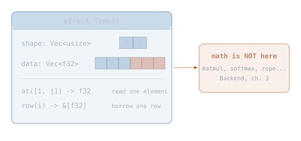
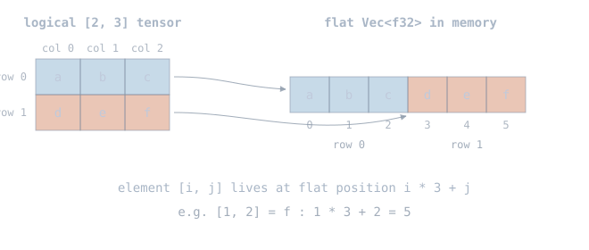
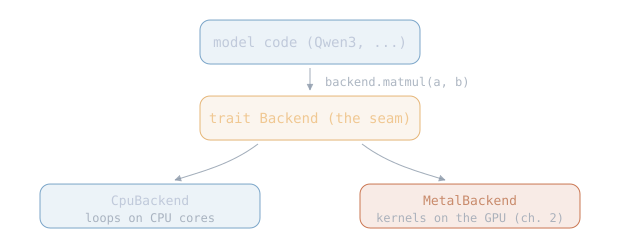
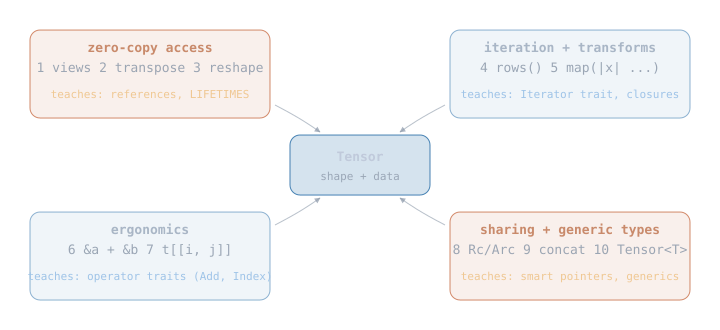

# Tensor 0

Every character in this engine handles the same substance: blocks of
floating-point numbers. Tensor is the one who carries them. Born first,
before any other part exists, it will be handed from the loader to the
model to the sampler for the rest of the story. Its defining trait is
restraint: it stores numbers, describes their shape, navigates them,
and refuses to do anything else.

This is Tensor's chapter: one struct, three jobs, one refusal.

<div class="diagram"></div>

Every later module passes these around: the loader produces them from
files, the model transforms them, the sampler reads the last one. Math
is deliberately absent from the struct: operations live behind the
backend seam (section 2.6, attached to the GPU in Metal 0), so the same tensor can be computed on by the
CPU today and the GPU later without changing any model code. The code
is `nucleon/src/tensor/tensor.rs` (~200 lines); tests sit next to it in
`tensor_tests.rs`.

## 2.1 The type

A tensor is a block of floats plus a shape that says how to interpret
them. A `[2, 3]` tensor holds 6 floats read as 2 rows of 3.

```rust
pub struct Tensor {
    shape: Vec<usize>,
    data: Vec<f32>,
}
```

> **Rust: `struct`.** Bundles named fields into one type; siblings are
> tuple structs `struct P(f32, f32)` and `enum` (one-of-several, Metal 0).
> [Book ch. 5](https://doc.rust-lang.org/book/ch05-01-defining-structs.html)
>
> **Rust: `pub`.** Default is private (no keyword); other levels are
> `pub` (everyone), `pub(crate)` (this crate), `pub(super)` (parent).
> Fields here stay private, so outsiders must use methods.
> [Book ch. 7](https://doc.rust-lang.org/book/ch07-03-paths-for-referring-to-an-item-in-the-module-tree.html)
>
> **Rust: `Vec<T>`.** Growable heap array that owns its contents;
> siblings: fixed-size array `[T; N]` (stack) and borrowed slice `&[T]`.
> `usize` is the index/length integer type.
> [Book ch. 8](https://doc.rust-lang.org/book/ch08-01-vectors.html)

Storage is row-major: one flat buffer, rows laid end to end, so the last
index moves fastest:

<div class="diagram"></div>

One rule must hold for every `Tensor` that ever exists: the number of
floats in `data` equals what the shape promises (`[2, 3]` promises
`2 * 3 = 6`). Such an always-true rule is called an *invariant*. The
constructors enforce it at creation, and because the fields are private,
nothing can break it afterwards, which is exactly why every method can
index into `data` without re-checking anything.

## 2.2 Constructors and the panic rule

```rust
impl Tensor {
    pub fn new(shape: Vec<usize>, data: Vec<f32>) -> Self {
        let expected = element_count(&shape);
        assert_eq!(
            data.len(),
            expected,
            "shape {shape:?} wants {expected} elements, got {}",
            data.len()
        );
        Self { shape, data }
    }
}
```

> **Rust: `impl` and `Self`.** Methods live in `impl` blocks; `Self` is
> the type being implemented.
> [Book ch. 5.3](https://doc.rust-lang.org/book/ch05-03-method-syntax.html)
>
> **Rust: ownership.** `new` takes the Vecs without `&`, so it takes
> ownership: the caller hands them over, the tensor frees them on drop.
> [Book ch. 4](https://doc.rust-lang.org/book/ch04-01-what-is-ownership.html)
>
> **Rust: `!` means macro.** Compile-time code generation, not a call.
> Family here: `assert!`/`assert_eq!` (checks), `debug_assert!`
> (debug-only), `vec!`, `panic!`, `format!`.
> [Book macros](https://doc.rust-lang.org/book/ch19-06-macros.html)
>
> **Rust: format strings.** `{shape:?}` embeds a variable; `:?` asks for
> the debug representation.
> [std::fmt](https://doc.rust-lang.org/std/fmt/index.html)

Why does `new` crash instead of returning an error? A project-wide rule:
`panic!` is for bugs in the calling code (a shape/data mismatch cannot
happen unless the caller is wrong); the `Result` type is for failures
the outside world can cause, like a corrupt checkpoint file. The loader
(The Loader) returns `Result` and validates everything before a tensor is
ever built.

The element count itself is computed with checked arithmetic:

```rust
fn element_count(shape: &[usize]) -> usize {
    checked_element_count(shape)
        .unwrap_or_else(|| panic!("shape {shape:?} element count overflows usize"))
}
```

> **Rust: `&` borrowing and slices.** `&[usize]` lends read access
> without moving ownership; any number of readers OR one writer, checked
> at compile time. [Book ch. 4.2](https://doc.rust-lang.org/book/ch04-02-references-and-borrowing.html)
>
> **Rust: `Option` and closures.** `Some(value)` or `None`; its sibling
> `Result` (Metal 0) carries an error instead of nothing. `|| ...` is a
> closure, an anonymous function.
> [Book ch. 6](https://doc.rust-lang.org/book/ch06-01-defining-an-enum.html#the-option-enum-and-its-advantages-over-null-values)
>
> **Rust: overflow is profile-dependent.** Debug builds panic on integer
> overflow; release builds silently wrap — hence `checked_mul` for all
> size arithmetic. [Book ch. 3.2](https://doc.rust-lang.org/book/ch03-02-data-types.html#integer-overflow)

## 2.3 Reading elements

```rust
pub fn at(&self, index: &[usize]) -> f32 {
    // rank and bounds asserts elided
    let mut flat = 0;
    for (dim, &i) in index.iter().enumerate() {
        flat = flat * self.shape[dim] + i;
    }
    self.data[flat]
}

pub fn row(&self, i: usize) -> &[f32] {
    let cols = self.shape[1];
    &self.data[i * cols..(i + 1) * cols]
}
```

> **Rust: `&self`.** Borrows the object read-only; `&mut self` would
> allow mutation, plain `self` would consume it.
> [Book ch. 5.3](https://doc.rust-lang.org/book/ch05-03-method-syntax.html)
>
> **Rust: `mut`.** Variables are immutable unless declared `let mut`.
> [Book ch. 3.1](https://doc.rust-lang.org/book/ch03-01-variables-and-mutability.html)
>
> **Rust: range slicing.** `&vec[a..b]` borrows a sub-region without
> copying; `row` hands out one matrix row this way.
> [Book ch. 4.3](https://doc.rust-lang.org/book/ch04-03-slices.html)

The last new constructs are in `from_fn`, the fixture builder:

```rust
let t = Tensor::from_fn(vec![2, 3], |idx| (10 * idx[0] + idx[1]) as f32);
```

> **Rust: `::` paths.** The compile-time "dot": navigates types and
> modules (`Tensor::from_fn`, `std::fmt::Display`).
> [Reference: paths](https://doc.rust-lang.org/reference/paths.html)
>
> **Rust: `as` casts.** Primitive conversion, here `usize` to `f32`;
> siblings `From`/`Into` (infallible) and `try_into` (checked) handle
> non-primitive cases.
> [Rust by Example](https://doc.rust-lang.org/rust-by-example/types/cast.html)

The values encode their own positions (`10*i + j`), which makes layout
bugs visible on sight in tests.

## 2.4 Printing, and a first trait

Small tensors print as a shape header plus matrix rows; big or empty
ones print just the header. This exists because debugging the math
chapters means staring at matrices.

```rust
impl std::fmt::Display for Tensor {
    fn fmt(&self, f: &mut std::fmt::Formatter<'_>) -> std::fmt::Result {
        // header, then rows for tensors up to 64 elements
    }
}
```

> **Rust: traits.** An interface a type can implement; `Display` is what
> `println!("{t}")` calls. The whole backend seam (section 2.6) is one
> trait. [Book ch. 10.2](https://doc.rust-lang.org/book/ch10-02-traits.html)
>
> **Rust: `#[derive(...)]`.** Auto-generates trait impls like `Debug`
> and `Clone`. `PartialEq` is deliberately absent: NaN != NaN makes
> float `==` a trap.
> [Book appendix C](https://doc.rust-lang.org/book/appendix-03-derivable-traits.html)
>
> **Rust: `pub(crate)`.** Crate-internal visibility; note an item inside
> a private module needs a re-export to actually be reachable.
> [Reference: visibility](https://doc.rust-lang.org/reference/visibility-and-privacy.html)

## 2.5 Where the math went

There are no math methods on `Tensor`, and the refusal is the most
consequential design choice in this chapter. NumPy writes `a.matmul(b)`:
the math is attached to the data type. nucleon separates them so the
executor can change under an unchanged model:

<div class="diagram"></div>

How the major libraries handle the same problem (verified against their
docs):

- [NumPy](https://numpy.org/doc/stable/reference/generated/numpy.ndarray.dot.html):
  methods on the array (`a.dot(b)`) plus free functions; CPU-only
  execution.
- [PyTorch](https://docs.pytorch.org/tutorials/advanced/dispatcher.html):
  methods on the tensor; each tensor carries a `.device`, and a
  dispatcher routes every call to the CPU/CUDA kernel for that device.
- [candle](https://docs.rs/candle-core/latest/candle_core/enum.Storage.html):
  methods on the tensor; storage is an enum (`Cpu`/`Cuda`/`Metal`) and
  each op matches on it to pick the implementation.
- [burn](https://docs.rs/burn-tensor/latest/burn_tensor/struct.Tensor.html):
  methods on the tensor; the executor is a type parameter,
  `Tensor<B: Backend, const D: usize>`.

So methods-with-internal-dispatch is the mainstream design. nucleon
chooses the explicit style anyway, for learning-first reasons:

- the executor is a visible function argument, not hidden tensor state
- nothing sits between the call and the loop that runs; there is no
  dispatcher to read through
- mixed-device bugs (CPU tensor meets GPU op) cannot exist, because
  tensors have no device at all

## 2.6 The trait: how Tensor gets its math

Tensor refuses to compute, so at its birthplace we also forge the thing
that computes: the `Backend` trait, one interface listing every
operation the engine will ever need, with the CPU implementation
attached as the default executor.

```rust
pub trait Backend {
    fn matvec(&self, w: &Tensor, x: &Tensor) -> Tensor;
    fn rmsnorm(&self, x: &Tensor, weight: &Tensor, eps: f32) -> Tensor;
    fn softmax(&self, x: &Tensor) -> Tensor;
    fn rope(&self, x: &Tensor, pos: u32, theta: f32) -> Tensor;
    fn attention(&self, q: &Tensor, k: &Tensor, v: &Tensor, scale: f32) -> Tensor;
    // ... add, mul, silu, embed, matmul, argmax
}

pub struct CpuBackend;
impl Backend for CpuBackend { /* plain loops, one per op */ }
```

`CpuBackend` is written to a frozen policy: naive, readable loops you can
step through in a debugger, never optimized. It is the reference:
every other executor is judged against its answers. One design choice matters
here: `attention` is a single trait method rather than something callers
compose from matmul and softmax, so an executor is free to implement it
as one fused pass (chapter 2 shows why that freedom is worth real
performance).

The code: trait in `backend/ops.rs`, CPU loops in `backend/cpu.rs`,
tests in `backend/cpu_tests.rs`: hand-worked cases (a 2x2 matvec done
on paper), properties (softmax sums to 1, rope preserves pair norms),
and behavior contracts (argmax ties take the lowest index).

## 2.7 Upcoming tensor topics

The struct above is everything the engine needs right now. Later
chapters (Tensor 1, Tensor 2, ...) extend it with the operations listed
below; each one is built when a part of the engine requires it, and
each teaches a specific Rust concept:

<div class="diagram"></div>

1. **Views**: borrow a slice of another tensor's memory, zero copy
   (references in depth, *lifetimes*)
2. **Transpose**: swapped view of the same data (strides, invariants)
3. **Reshape**: same floats, new shape (consuming `self`, `Result`)
4. **Row iterators**: `for row in t.rows()` (the `Iterator` trait)
5. **`map`**: `t.map(|x| x * 2.0)` (closures as parameters, `FnMut`)
6. **Operator overloading**: `&a + &b` (the `std::ops::Add` trait)
7. **Index sugar**: `t[[i, j]]` (the `Index` trait)
8. **Shared tensors**: one weight, many users (`Rc`, `Arc`)
9. **Concatenation**: building tensors from parts (slices, capacity)
10. **Generic dtype**: `Tensor<T>` (generics, trait bounds)

Some of these graduate into the engine (views make the KV cache
zero-copy; `map` feeds the sampler); others are pure Rust lessons. The
chapter that builds each one will say which it is.
