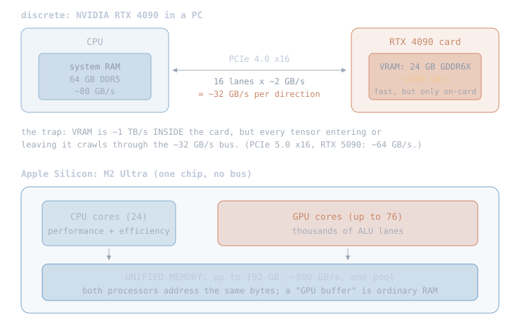
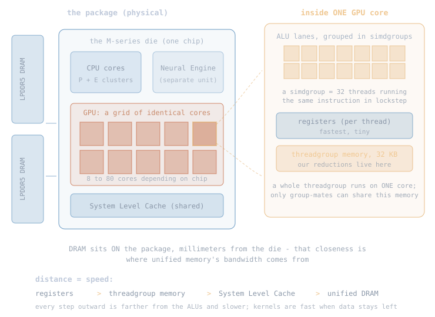
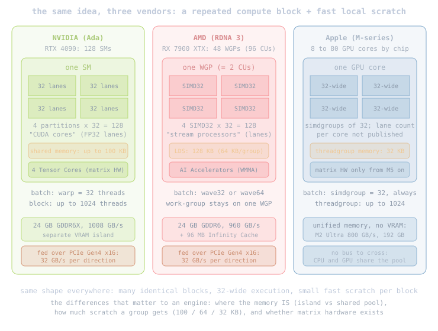

# GPU

The engine runs on Apple Silicon's GPU, so the first thing to
understand is the hardware itself: what a GPU physically is, where
its memory lives, and how Apple's design differs from NVIDIA and
AMD. The next chapter, [Metal](02-metal.md), writes software for it;
the one after that, [MLX](03-mlx.md), is Apple's library on top of
Metal that becomes nucleon's compute layer.

## 3.1 The hardware: what an Apple Silicon GPU is

A GPU is a second processor optimized for one thing: running the same
small program on thousands of data elements at once. A CPU core is built
to run one instruction stream very fast; a GPU is built to run thousands
of slow, identical streams in parallel. Matrix math is exactly that shape
of work.

On a PC, the GPU is a separate card with its own memory. Take a
concrete one, the NVIDIA RTX 4090: its 24 GB of GDDR6X VRAM moves data
at ~1008 GB/s, but only inside the card. Everything entering or
leaving crosses PCIe 4.0 x16: sixteen lanes of ~2 GB/s each, ~32 GB/s
per direction, about 30x slower than the VRAM it feeds:

Two consequences drive this whole project. First, a 30 GB model can sit
in memory once and be visible to both processors; handing a tensor to the
GPU costs nothing. Second, during token generation the model reads every
weight once per token, so the ~8x memory bandwidth advantage of the GPU
path is the entire speedup we are chasing.

## 3.2 A physical view: where things actually are

Before any API, fix the physical picture. Software words like "thread"
and "buffer" name real places on the chip:

| when we say | it physically is |
|---|---|
| a thread | one ALU lane executing the kernel, on one GPU core |
| a simdgroup | 32 threads in lockstep (threadExecutionWidth = 32 on all Apple GPUs) |
| a threadgroup | up to 1024 threads all resident on ONE core |
| threadgroup memory | 32 KB on that same core (Metal feature tables) |
| a buffer | a range of unified DRAM sitting on the package |
| a kernel | compiled instructions every participating lane executes |
| the grid | the set of threadgroups scheduled across the core array |

The hardware words themselves, with references:

- **package**: the physical carrier that the chip and its DRAM are
  mounted on together
  ([IC packaging](https://en.wikipedia.org/wiki/Integrated_circuit_packaging));
  on Apple Silicon the memory shares the package with the die.
- **die**: the actual piece of silicon holding all the circuits
  ([die](https://en.wikipedia.org/wiki/Die_(integrated_circuit))).
- **ALU lane**: one arithmetic-logic unit, the circuit that executes one
  thread's math each cycle
  ([ALU](https://en.wikipedia.org/wiki/Arithmetic_logic_unit)).
- **SRAM**: fast on-die memory built from transistors, used for
  registers, caches, and threadgroup memory
  ([SRAM](https://en.wikipedia.org/wiki/Static_random-access_memory)).
- **LPDDR5 DRAM**: the dense, lower-power memory chips holding the
  unified memory pool
  ([LPDDR](https://en.wikipedia.org/wiki/LPDDR)).
- **System Level Cache**: Apple's last-level cache on the die, shared by
  CPU, GPU, and Neural Engine.
- **kernel**: the small function you write for the GPU (ours live in
  ops.metal); at execution, every participating ALU lane runs its body
  once, each with its own index.
- **pipeline**: one kernel after compilation for this specific GPU,
  ready to launch; held as a
  [MTLComputePipelineState](https://developer.apple.com/documentation/metal/mtlcomputepipelinestate).
- **Neural Engine (ANE)**: a separate fixed-function accelerator for
  neural-network inference, outside the GPU. It has no public
  programming model (only Core ML can target it), so custom engines
  like nucleon use the programmable GPU instead.

This is why the rules of chapter 2 are what they are: threads in one
group can share memory and synchronize because they are on the same
physical core; threads in different groups cannot, because they may be
on different cores with no wire between their SRAMs. And a kernel is
fast when its data stays near the left of the ladder (registers and
threadgroup memory) instead of round-tripping to DRAM.

## 3.3 How Apple's GPU differs from NVIDIA and AMD

All three vendors build GPUs the same general way: a grid of identical
compute blocks, each executing threads in 32-wide batches with a small
fast scratch memory per block. The names differ, the trade-offs differ:

| concept | NVIDIA (CUDA) | AMD (RDNA) | Apple (Metal) |
|---|---|---|---|
| compute block | SM | WGP (= 2 CUs) | GPU core |
| 32-wide batch | warp | wave32 / wave64 | simdgroup (always 32) |
| one lane | "CUDA core" | "stream processor" | ALU lane |
| fast scratch | shared memory, up to 100 KB | LDS, 64 KB per group | threadgroup memory, 32 KB |
| software group | thread block (max 1024) | work-group | threadgroup (max 1024) |
| matrix hardware | Tensor Cores | AI Accelerators | none until M5 |

The differences that matter to an inference engine:

- Memory location: NVIDIA and AMD weights live in a VRAM island (24 GB
  class) loaded over PCIe at 32 GB/s per direction (Gen4 x16, NVIDIA's
  own figure); Apple weights live in the one unified pool, up to 192 GB
  (M2 Ultra) or 512 GB (M3 Ultra), with no transfer step at all.
- Peak bandwidth is the same order of magnitude at the top: M2 Ultra
  800 GB/s, RX 7900 XTX 960 GB/s, RTX 4090 1008 GB/s (RTX 5090:
  1792 GB/s).
- Scratch budget: 32 KB per threadgroup on Apple vs 64 KB (AMD) and up
  to 100 KB (NVIDIA), so Apple kernels tile their data smaller, which is
  exactly why our attention kernel caps its in-scratch score row.
- The two vendors count different units and call both "cores." A "CUDA
  core" is one arithmetic lane rather than a full processor; NVIDIA's
  processor-like block is the SM, which contains 128 lanes (RTX 4090:
  128 SMs x 128 = "16384 CUDA cores"). Apple counts the blocks instead:
  "76-core GPU" counts SM-equivalents, and Apple never publishes lanes
  per block. Comparing 16384 to 76 is comparing different units.
- Dedicated matrix hardware (NVIDIA Tensor Cores, AMD WMMA) means a
  separate circuit that computes a small matrix block as one operation.
  Apple's GPU gains its first such circuit with the M5's Neural
  Accelerators. On M1 through M4, the simdgroup_matrix API exists, and
  it compiles to regular multiply-adds on the same float units that run
  all other kernel math.

Sources: [NVIDIA Ada whitepaper](https://images.nvidia.com/aem-dam/Solutions/geforce/ada/nvidia-ada-gpu-architecture.pdf),
[CUDA programming guide](https://docs.nvidia.com/cuda/cuda-programming-guide/),
[NVIDIA on PCIe bandwidth](https://developer.nvidia.com/blog/nvidia-hopper-architecture-in-depth/),
[AMD RDNA3 ISA guide](https://www.amd.com/content/dam/amd/en/documents/radeon-tech-docs/instruction-set-architectures/rdna3-shader-instruction-set-architecture-feb-2023_0.pdf),
[GPUOpen on occupancy](https://gpuopen.com/learn/occupancy-explained/),
[RX 7900 XTX specs](https://www.amd.com/en/products/graphics/desktops/radeon/7000-series/amd-radeon-rx-7900xtx.html),
[Apple: scale compute workloads (WWDC22)](https://developer.apple.com/videos/play/wwdc2022/10159),
[Metal Feature Set Tables](https://developer.apple.com/metal/Metal-Feature-Set-Tables.pdf),
[Apple on TBDR and tile memory](https://developer.apple.com/documentation/metal/tailor-your-apps-for-apple-gpus-and-tile-based-deferred-rendering),
[M2 Ultra](https://www.apple.com/newsroom/2023/06/apple-introduces-m2-ultra/),
[M3 Ultra](https://www.apple.com/newsroom/2025/03/apple-reveals-m3-ultra-taking-apple-silicon-to-a-new-extreme/),
[M5](https://www.apple.com/newsroom/2025/10/apple-unleashes-m5-the-next-big-leap-in-ai-performance-for-apple-silicon/).

Section 3.2's table maps the software words (kernel, thread, buffer) to
physical places; Metal 0 puts every one of them to work.
