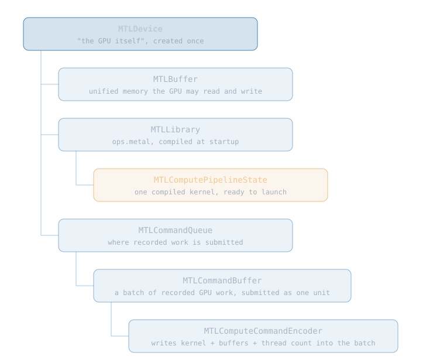
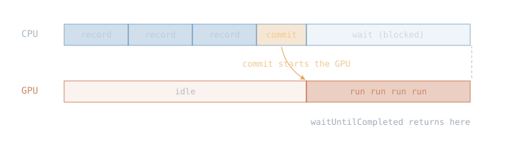
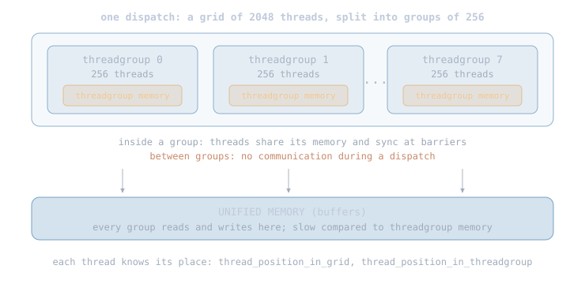
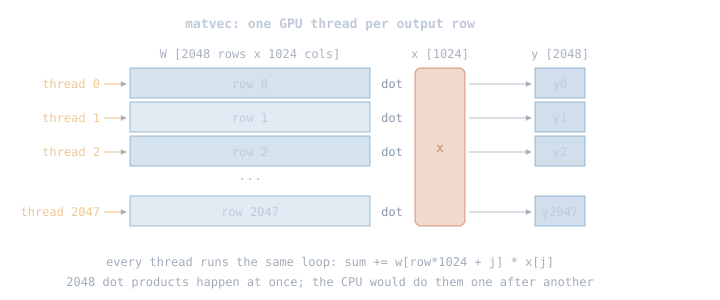
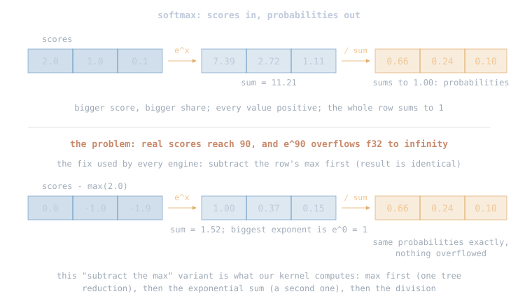
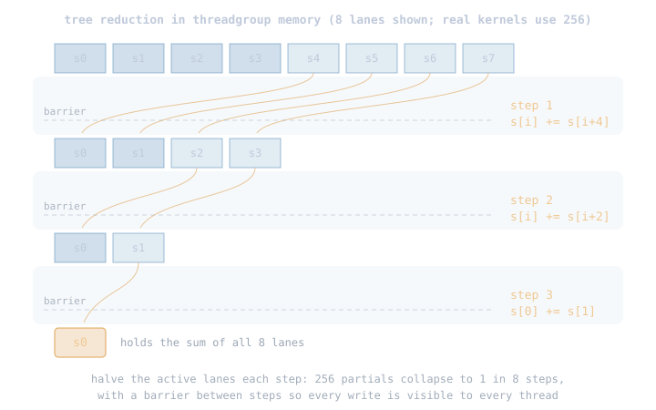
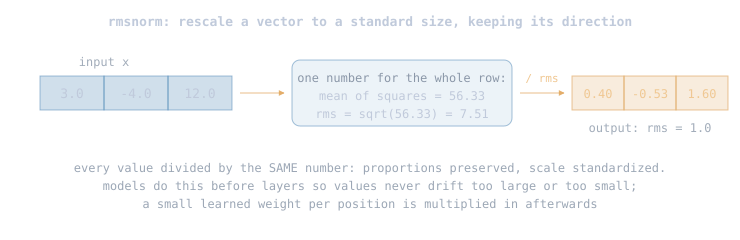
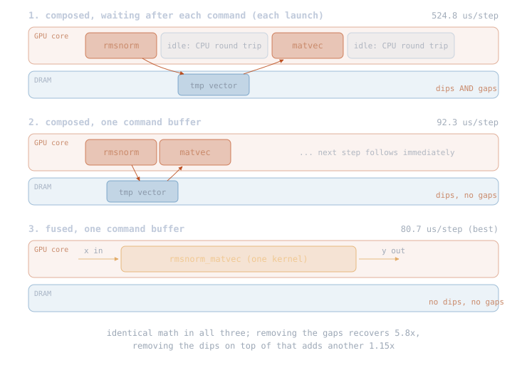
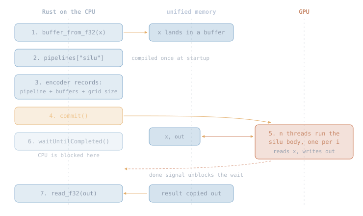

# Metal 0

GPU 0 covered the hardware: the cores, the memories, the distances. This
chapter writes software for it. By the end, every tensor operation from
Tensor 0 runs on the GPU, the measurements show why kernel fusion
matters, and the chapter closes by attaching the GPU to the same Backend
trait the CPU lives behind.

## 4.1 Metal: the library that drives the GPU

Metal is Apple's API for programming their GPU, the equivalent of CUDA on
NVIDIA. Two languages are involved: host code (Rust for us, via the
objc2-metal bindings) runs on the CPU and orchestrates; kernel code,
written in Metal Shading Language (MSL, a C++ dialect), is what the GPU
executes. Our kernels live in one file, `kernels/ops.metal`; it is the
only non-Rust code in the project.

Five Metal objects appear in every program. Our `device.rs` wraps exactly
these and nothing more:

<div class="diagram"></div>

Apple's reference for each object:
[Metal framework](https://developer.apple.com/documentation/metal),
[MTLDevice](https://developer.apple.com/documentation/metal/mtldevice),
[MTLBuffer](https://developer.apple.com/documentation/metal/mtlbuffer),
[MTLLibrary](https://developer.apple.com/documentation/metal/mtllibrary),
[MTLComputePipelineState](https://developer.apple.com/documentation/metal/mtlcomputepipelinestate),
[MTLCommandQueue](https://developer.apple.com/documentation/metal/mtlcommandqueue),
[MTLCommandBuffer](https://developer.apple.com/documentation/metal/mtlcommandbuffer),
[MTLComputeCommandEncoder](https://developer.apple.com/documentation/metal/mtlcomputecommandencoder);
the kernel language is specified in the
[Metal Shading Language Specification](https://developer.apple.com/metal/Metal-Shading-Language-Specification.pdf).

The part that surprises CPU programmers: you never call a kernel like a
function. A command buffer starts as an empty batch, and it cannot be
written directly. You open an *encoder* on it, the writer object whose
calls (bind pipeline, bind buffers, declare how many threads) are
translated into the packed command format the GPU hardware consumes.
`endEncoding` closes the encoder; *commit* hands the finished batch to
the queue. The GPU executes it asynchronously;
`waitUntilCompleted` blocks the CPU until it is done:

<div class="diagram"></div>

Each commit-and-wait round trip costs microseconds. That sounds small,
but a decode-step's worth of math is also microseconds, which is why the
measurements later in this chapter matter.

## 4.2 How a kernel executes: the thread grid

A CPU op is a loop. The GPU version keeps only the loop body; the
hardware runs it once per element, in parallel, and each running
instance (a thread) learns which element it owns from its position in
the grid:

```rust
// CPU: the loop header decides which element is next
for i in 0..n {
    out[i] = a[i] + b[i];
}
```

```metal
// GPU: no loop; each of the n threads gets its own i from the hardware
kernel void add(device const float* a, device const float* b,
                device float* out, uint i [[thread_position_in_grid]]) {
    out[i] = a[i] + b[i];
}
```

Threads are organized in two levels. The grid is split into
*threadgroups* (we use 256 threads per group). Threads in the same group
run on the same GPU core, can share a small piece of very fast on-chip
memory ("threadgroup memory"), and can synchronize with each other at a
barrier. Threads in different groups cannot communicate at all during a
dispatch:

<div class="diagram"></div>

This two-level structure decides how every kernel in `ops.metal` is
written. Our kernels fall into two families.

## 4.3 Family 1: map kernels, one thread per output

`add`, `mul`, `silu`, `embed`, `matvec`, `matmul`, and `rope` never need
threads to talk to each other: each thread computes one output element
from inputs it reads directly. `matvec` is the important one, because
y = W @ x with one token is what generation does thousands of times per
second. One thread owns one output row and computes a dot product:

<div class="diagram"></div>

For Qwen3's q_proj that is 2048 threads each doing 1024 multiplies. The
CPU does those 2048 dot products one after another; the GPU does them at
once, limited only by how fast memory feeds it the weights.

## 4.4 Family 2: reduction kernels, threads that must cooperate

`rmsnorm`, `softmax`, and `argmax` each need a fact about an ENTIRE row
(its sum of squares, its max, its total) before any output can be
written. No single thread can compute that alone in reasonable time, so
the threads of one threadgroup cooperate through threadgroup memory.

Take softmax as the worked example for this whole family. It turns a
row of scores into probabilities, and every real engine computes the
max-subtracted variant, because plain softmax overflows on large scores:

<div class="diagram"></div>

Both facts softmax needs (the row's max, then the row's sum) are
whole-row questions, and the threads of one group answer them together.
The pattern: every thread first accumulates a private partial over a
strided slice of the row, parks it in threadgroup memory, and a *tree
reduction* combines the 256 partials in 8 steps. A barrier between steps
makes each round's writes visible to all threads:

<div class="diagram"></div>

So the softmax kernel is exactly two tree reductions (max, then the
sum of shifted exponentials) plus a final divide. The other two family
members follow the identical pattern with a different question per row:
`argmax` reduces (value, index) pairs, breaking ties toward the lower
index so greedy sampling is deterministic, and `rmsnorm` (defined in
the next section, where we fuse it) reduces a sum of squares. These
kernels are why the threadgroup concept exists; none of them can be
expressed as a pure map.

## 4.5 The fusion lesson, measured on an M3 Max

Families 1 and 2 were about single operations on the GPU: one op, one
kernel, and the map/reduction split describes how threads behave inside
it. Fusion is about what happens across operations: how many ops go
into one kernel launch. The two questions are independent, and the
fused kernel built below contains both shapes, a reduction first and a
map after it, inside a single launch.

The experiment chains two operations. The second is matvec, covered in
Family 1. The first is rmsnorm, which rescales a vector to a standard
size by dividing every value by one number, the root-mean-square of the
row:

<div class="diagram"></div>

The sum-of-squares it needs is a whole-row fact, computed with the same
tree reduction softmax used in Family 2.

The measured shape, concretely: x is a vector of 1024 values, W is a
weight matrix of 2048 rows by 1024 columns, and the pair runs 500 times
in a row. Sizes in this range are what the engine built in later
chapters computes over and over.

The computation itself is fixed: rmsnorm runs on x, and its output
goes into matvec. The choice is how to package that fixed computation
into kernels. Package it as two kernels and the GPU runs one, stores
the intermediate, then runs the other. Package it as one merged kernel
and the intermediate never gets stored. That merging is called
*fusion*, and it is the standard trick every serious GPU library leans
on. Side by side:

- **composed**: two launches; the rmsnorm kernel writes its result to
  memory, the matvec kernel reads it back.
- **fused**: one launch of one merged kernel — the normalized values
  never leave the GPU core.

We measured four runs. Run 1 is composed with every command in its own
command buffer, the CPU waiting after each one (each launch): it pays
the DRAM dips AND leaves the GPU idle during each CPU round trip. Run 2
records everything into one command buffer first: same dips, no gaps.
Runs 3 and 4 are two versions of the fused kernel, a failed first
attempt and the rewrite that stayed: no dips, no gaps. The three
packagings in one picture:

<div class="diagram"></div>

What the three variants look like in code. The vocabulary they use:

1. `run`: executes ONE kernel and waits (used in the next section).
2. `run_many`: takes a list of recorded calls, commits them as one
   command buffer, and waits once.
3. `KernelCall`: one entry in that list; a plain struct naming the
   kernel, its buffers, and its grid size.
4. `rmsnorm_call()` and friends: helpers that build one `KernelCall`.

The real code from `examples/fusion.rs`, condensed:

Variant 1, every call in its own command buffer, waiting after each:

```rust
for _ in 0..STEPS {
    unsafe { gpu.run_many(&[rmsnorm_call()]) };  // commit + wait
    unsafe { gpu.run_many(&[matvec_call()]) };   // commit + wait again
}
```

Variant 2, the same two kernels, all steps recorded first, one commit,
one wait:

```rust
let calls: Vec<KernelCall> =
    (0..STEPS).flat_map(|_| [rmsnorm_call(), matvec_call()]).collect();
unsafe { gpu.run_many(&calls) };
```

Variant 3, the fused kernel: half as many calls, no tmp buffer at all:

```rust
let calls: Vec<KernelCall> =
    (0..STEPS).map(|_| fused_call()).collect();
unsafe { gpu.run_many(&calls) };
```

The measurements, on an Apple M3 Max (128 GB):

| # | variant | per step |
|---|---|---|
| 1 | composed, wait after each command (launch) | 524.8 us |
| 2 | composed, one command buffer | 92.3 us |
| 3 | fused, first attempt (naive) | 134.1 us |
| 4 | fused, cooperative (the kernel we kept) | 80.7 us |

Each lesson comes straight from a pair of rows:

1. **Rows 1 to 2: waiting per launch costs 5.8x** (524.8 to 92.3). The
   commit-and-wait round trip dwarfs the math itself at this size. Real
   engines record hundreds of launches into one command buffer and wait
   once. This is the first-order effect, bigger than fusion, and it
   sets a requirement for the engine's design: the op layer must allow
   batching launches.
2. **Row 3 vs row 2: our first fused kernel LOST to composed** (134.1
   vs 92.3). It made each of the 2048 matvec threads privately
   recompute the sum-of-squares over the whole input, and that
   duplicated arithmetic cost more than the launch and memory round
   trip it saved. Fusion is a trade, and the trade can go negative.
3. **Row 4: the rewrite that won** (80.7, 1.15x over row 2). Two fixes.
   The threads of a threadgroup compute the sum-of-squares once,
   cooperatively, with the tree reduction: one shared computation per
   group of 256 instead of 2048 private ones. And rmsnorm just
   multiplies the vector by one number (1 over the root-mean-square);
   scaling the input of a matvec equals scaling its output,
   W @ (s * x) = s * (W @ x), so the kernel runs the plain matvec and
   multiplies by that number at the end. Sometimes the fusion tool is
   algebra rather than memory layout.

## 4.6 The Rust side: one op, end to end

`device.rs` is ~280 lines, but one simple operation shows the whole
setup. Take `silu`. The Rust call a user makes:

```rust
pub fn silu(&self, x: &[f32]) -> Vec<f32> {
    let xb = self.gpu.buffer_from_f32(x);           // input into unified memory
    let out = self.gpu.buffer_for_output(x.len());  // zero-filled result buffer
    unsafe { self.gpu.run("silu", &[&xb, &out], &[], (x.len(), 1), None) };
    self.gpu.read_f32(&out, x.len())                // copy the result back out
}
```

> **Rust: `unsafe`.** A block where the compiler's memory-safety checks
> stop and the programmer vouches for a documented contract; siblings
> are `unsafe fn` (the whole function needs the contract) and safe
> wrappers that check preconditions before entering.
> [Book ch. 20.1](https://doc.rust-lang.org/book/ch20-01-unsafe-rust.html)

How the call attaches to Metal — the essentials of `Gpu::run`. One
note on reading it: the objc2 bindings keep Apple's Objective-C method
names (`newBufferWithBytes_length_options`), which looks odd in Rust
but maps 1:1 onto Apple's documentation pages:

```rust
// `kernel` is just a name, the string "silu". `pipelines` is the map
// built at startup: kernel name -> that kernel compiled and ready.
let pipeline = &self.pipelines[kernel];
let cmd = self.queue.commandBuffer()?;        // an empty batch
let enc = cmd.computeCommandEncoder()?;       // the writer for that batch
enc.setComputePipelineState(pipeline);        // which kernel
enc.setBuffer_offset_atIndex(Some(buf), 0, i);// bind x and out to slots 0, 1
enc.dispatchThreads_threadsPerThreadgroup(grid, tg); // x.len() threads
enc.endEncoding();
cmd.commit();                                 // the GPU starts HERE
cmd.waitUntilCompleted();                     // the CPU blocks until done
```

And what the GPU itself executes, once per thread:

```metal
kernel void silu(device const float* x, device float* out,
                 uint i [[thread_position_in_grid]]) {
    float v = x[i];
    out[i] = v / (1.0f + exp(-v));
}
```

Who executes what, and when:

<div class="diagram"></div>

Everything up to `commit` is ordinary Rust running on the CPU: no GPU
work has happened yet, only a description of work has been written into
the command buffer. `commit` hands that description to the GPU, which
runs one thread per element against the same unified memory the CPU
filled. The CPU sleeps in `waitUntilCompleted` and then reads the result
bytes directly — no transfer, because both processors address the same
pool.

## 4.7 What unsafe means here

The `unsafe` keyword marks the exact places where the Rust compiler's
memory-safety checking stops and a documented contract takes over. In
this crate there are three such places: copying bytes into a shared
buffer, binding buffers to an encoder, and launching a kernel.

Why is launching a kernel unsafe? Because buffers are shared process
memory on Apple Silicon. If a kernel writes out of bounds, it does not
just corrupt its own output; it corrupts whatever program data happens
to sit next to the buffer. That is precisely the class of bug Rust's
safety rules exist to prevent, and the compiler cannot check what a
GPU does, so the boundary is marked `unsafe` and carries a written
contract instead.

The design that keeps this manageable: all `unsafe` lives in one file
(`device.rs`), and the safe wrapper layer (`ops.rs`) checks every
precondition — shapes, sizes, 32-bit index limits — before touching
it. Callers of `ops.rs` cannot reach the contract unchecked.

## 4.8 When something goes wrong

Failures on the GPU boundary are easy to make silent by accident, so
three rules hold everywhere in the crate:

1. A shader that fails to compile panics with the Metal compiler's own
   diagnostic text, not a generic error.
2. A command buffer that finishes in any state other than Completed
   panics with the GPU's error; its output buffers are never read.
3. On a machine with no GPU, every test prints that it is skipping;
   a kernel compile error still fails the suite instead of skipping.

## 4.9 Attaching the GPU trait

The chapter's closing move: `MetalBackend` implements the same `Backend`
trait as `CpuBackend`. Each method converts a `Tensor` to the flat
slices kernels speak, dispatches, and wraps the result back:

```rust
impl Backend for MetalBackend {
    fn matvec(&self, w: &Tensor, x: &Tensor) -> Tensor {
        Tensor::new(vec![w.shape()[0]], self.ops.matvec(w.data(), x.data()))
    }
    // ... every other op, the same shape of delegation
}
```

Attention is where the trait design pays off. Because it is one method,
the GPU implements it as ONE kernel: scores, softmax, and the weighted
value sum in a single dispatch, the score row living in fast threadgroup
memory and never touching RAM. Composition (matmul kernel, softmax
kernel, matmul kernel) would have forced three round trips.

The contract holding it all together is trait-level parity: the same
calls through the same trait, CPU vs GPU, must agree within a small
tolerance (exact equality is the wrong bar, because GPU threads add
floats in a different order than a CPU loop does). The parity suite
covers every op, edge sizes that exercise idle reduction lanes, NaN
and -inf behavior, and grouped-query attention at sequence lengths
past the thread-count boundaries. From here on, any code written against
`Backend` runs on either executor, and the story never has to ask which.

## 4.10 Upcoming Metal topics

The kernels in this chapter are correct but naive on purpose. The GPU
returns in [The Fast Kernels](11-fast-kernels.md) to build these; each
teaches a specific technique:

1. **Tiled matmul**: load a block of data into threadgroup memory and
   have all 256 threads reuse it many times before sliding to the next
   block (data reuse inside one kernel).
2. **FlashAttention**: attention computed over K and V tiles with a
   running max and sum, so the full score row never exists; this
   removes our attention kernel's seq 4096 cap (online softmax).
3. **simdgroup_matrix**: the matrix-multiply intrinsics API, and what
   changes when M5 adds dedicated hardware behind it.
4. **Benchmarks**: every step measured against llama.cpp and MLX on the
   same machine.
