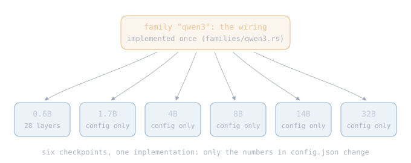
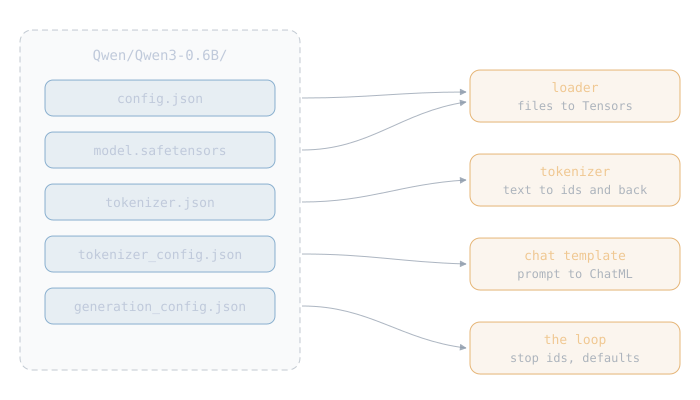
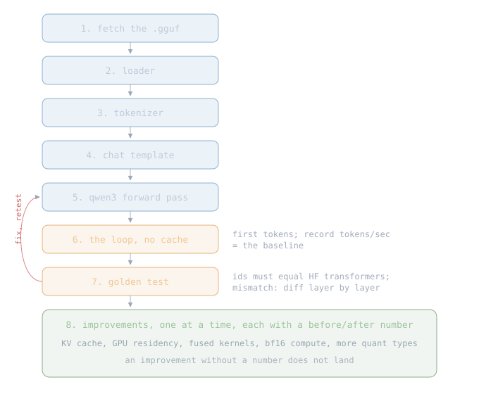

# The Engine

Part I built parts: a tensor, eleven operations, two executors that
agree. Part II assembles them into an engine that loads Qwen3-0.6B and
generates text. This chapter is the plan: premise, package, inventory,
order, rule.

## 5.1 What Part I left us

- `Tensor` ([Tensor 0](01-tensor.md)): shape plus flat f32 data.
- `trait Backend` ([Tensor 0](01-tensor.md), [Metal 0](02-metal.md)):
  add, mul, silu, embed, matvec, matmul, rmsnorm, softmax, rope,
  attention, argmax.
- `CpuBackend`: the naive loops that define correct.
- `MetalBackend`: the same trait on the GPU, held to the CPU by parity
  tests.

## 5.2 Models ship as families

- checkpoint: one trained model you can download; a folder of weights
  and configuration. The real one:
  [Qwen/Qwen3-0.6B](https://huggingface.co/Qwen/Qwen3-0.6B) on
  Hugging Face (HF), the site checkpoints are distributed through.
- family: the architecture checkpoints share. The `model_type` field
  in config.json ("qwen3") names it.
- Qwen3 shipped six dense checkpoints: 0.6B, 1.7B, 4B, 8B, 14B, 32B.
  Same wiring, different numbers. (The MoE releases are a separate
  family, `qwen3_moe`, whose MLP is routed experts; not building it.)

Supporting a family costs two gates, and paying them is what "the
engine supports a model family" means in this book:

1. correctness gate: every block wired exactly right, proven by the
   golden test (map chapter's
   [1.5](00-big-picture.md#15-correctness));
2. speed gate: fast kernels for the family's shapes (Part III).

We pay them for two families:

- `qwen3`: this part, smallest checkpoint first. Its numbers, from the
  real [config.json](https://huggingface.co/Qwen/Qwen3-0.6B/blob/main/config.json)
  (also as [raw JSON](https://huggingface.co/Qwen/Qwen3-0.6B/raw/main/config.json),
  the exact bytes our loader reads):

| config.json field | Qwen3-0.6B |
|---|---|
| num_hidden_layers | 28 |
| hidden_size | 1024 |
| num_attention_heads / num_key_value_heads | 16 / 8 |
| head_dim | 128 (an explicit field, NOT hidden/heads = 64) |
| intermediate_size | 3072 |
| vocab_size | 151936 |
| rope_theta / rms_norm_eps | 1000000 / 1e-6 |
| tie_word_embeddings | true |

- `qwen3_5`: the flagship, Qwen3.8-27B, a 64-layer hybrid needing new
  operations ([Qwen3.8, the hybrid](13-qwen38.md)). Part II never
  touches it, but it already shaped two designs: the cache is a trait,
  and families own every model-specific decision.

## 5.3 The package on disk

A checkpoint downloads as a folder
([browse Qwen3-0.6B's](https://huggingface.co/Qwen/Qwen3-0.6B/tree/main)):

| file | role |
|---|---|
| config.json | the family name and every dimension number above |
| model.safetensors | all 311 weight tensors, bf16, about 1.2 GB |
| tokenizer.json | the full tokenizer: vocab and merge rules |
| tokenizer_config.json | the chat template and special token names |
| generation_config.json | stop token ids and default sampling settings |

config.json has no specification. No standards body, no list of legal fields, no stability promise: each lab ships whatever fields its architecture needs, and may add, rename, or repurpose them next release.

This is a large part of why engines are hard. They lag new models not because the math is secret, but because someone must read each new config and modeling code and rewire the engine to match. Every architecture, every time.

The only shared parts are conventions from the HF transformers
library, which writes the file when a lab saves its model:

1. `model_type` selects a configuration class inside that library;
2. that class is the only schema there is
   ([Qwen3Config](https://huggingface.co/docs/transformers/model_doc/qwen3)
   for "qwen3");
3. the handful of fields every model shares comes from its base class,
   [PretrainedConfig](https://huggingface.co/docs/transformers/main_classes/configuration).

So reading the config is the first step of supporting any model, every
time, and it always carries surprises:

1. Qwen3-0.6B: `head_dim: 128` explicit, while hidden/heads = 64.
   Compute instead of read, and every weight loads, then the model
   generates garbage.
2. Qwen3.8-27B: one generation later, same lab, new fields qwen3 never
   had: `full_attention_interval: 4`, `partial_rotary_factor: 0.25`.
3. DeepSeek-V2-Lite: `q_lora_rank: null` turns a whole projection
   block off; the larger checkpoint of the same `model_type` has it
   on.

It is also why our loader takes no defaults for required fields: with
no standard to fall back on, a value the file does not state is an
error, not a guess.

Format and dtype words for the table above:

- safetensors: the weights container. 8 bytes of header length, a JSON
  header mapping tensor name to dtype, shape, and byte range, then raw
  bytes. Our loader parses it directly.
- GGUF: llama.cpp's single-file container, usually holding quantized
  (reduced-precision) weights. Part III
  ([Quantization](12-quantization.md)).
- bf16: a 16-bit float with f32's exponent range and fewer fraction
  bits; what the weights are stored in. Part II converts to f32 at
  load; computing in bf16 is Part III.

Where the formats come from: safetensors is Hugging Face's own format, built in 2022 to replace pickle-based PyTorch checkpoint files, which can execute arbitrary code when loaded. Its reference implementation is written in Rust, and our loader uses that exact crate (<a href="https://huggingface.co/docs/safetensors/index">format docs</a>, <a href="https://github.com/huggingface/safetensors">source</a>).

GGUF comes from the llama.cpp project: one self-describing file carrying weights and all metadata as key-value pairs (dimensions, even the whole tokenizer), so nothing sits beside it. Unlike config.json, GGUF has an actual written <a href="https://github.com/ggml-org/ggml/blob/master/docs/gguf.md">specification</a>.

## 5.4 What loading requires

The loader's contract, strict on purpose:

1. every tensor the config promises is present, with the exact shape;
2. any tensor the config does not explain is an error (one exception:
   the tied lm_head copy, byte-identical to the embedding table);
3. bf16 converts to f32 once, at load;
4. nothing from the file is trusted: byte ranges bounds-checked, sizes
   checked-multiplied, shard names path-checked.

Why strict: a missing or misshapen weight does not crash a
transformer; it generates fluent, wrong tokens. Fail at load, not
mid-generation.

## 5.5 The op inventory

One decode step of Qwen3, as operation calls (the full walk is
[Qwen3](07-qwen3.md)'s chapter):

1. embed: look the token id up in the embedding table.
2. 28 times, once per layer:
   1. rmsnorm, three matvecs (q, k, v projections);
   2. rmsnorm on each q and k head, rope on q and k;
   3. attention, one call: scores, softmax, weighted values;
   4. matvec (output projection), add (residual);
   5. rmsnorm, two matvecs (gate, up), silu, mul, matvec (down), add.
3. final rmsnorm; matvec against the embedding table (tied) for
   logits; argmax picks the token.

Checked against the trait:

- every call above is one of the eleven operations: implemented on
  both executors, parity-tested, zero new kernels needed for Part II;
- softmax: not called directly, runs inside attention;
- matmul: takes over from matvec when prefill (map chapter's
  [1.3](00-big-picture.md#13-prefill-and-decode)) processes many
  tokens at once.

## 5.6 The build order

The rule: every block lands plain and correct first; every
optimization after that shows a before/after number on the same
machine (the Apple M3 Max this book measures on).

The steps, each a chapter:

1. fetch the Qwen3-0.6B package;
2. [The Loader](04-loader.md): folder in, checked f32 tensors out;
3. [The Tokenizer](05-tokenizer.md): text to ids and back, safe to
   stream;
4. the chat template: user text to ChatML, the conversation format
   Qwen3 was trained on; the template, never the tokenizer, inserts
   special tokens ([The CLI](10-cli.md));
5. [Qwen3](07-qwen3.md): the forward pass from the inventory above;
6. [The Loop](09-generate.md), naive on purpose: no cache, each step
   re-runs the whole sequence; greedy pick; stop on ids 151645 and
   151643; tokens/sec recorded as the baseline;
7. the golden test: same prompt through HF transformers, greedy both
   sides, ids match exactly; on mismatch, diff hidden states layer by
   layer and fix the first divergence;
8. improvements, one at a time, each measured:
   [The Cache](06-cache.md) removes step 6's re-work, then GPU
   residency, fused kernels, bf16 compute, quantized weights
   (Part III).

## 5.7 Upcoming engine topics

Visible from here, scheduled after Parts II and III:

1. batching: several generation requests in one forward pass;
2. a server API, so other programs call nucleon without linking it;
3. speculative and multi-token-prediction decoding (Qwen3.8 ships an
   MTP head we skip at first);
4. nucleon-cuda, a third `Backend`.

Next: [The Loader](04-loader.md).
