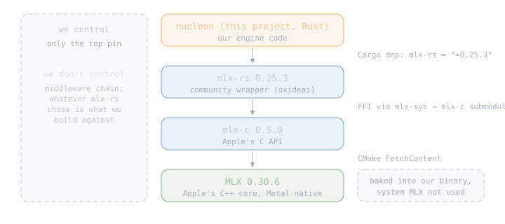
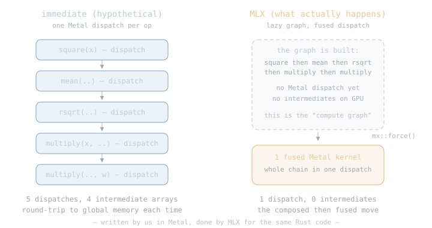

# MLX

The [Metal](02-metal.md) chapter taught what the GPU costs, what a
kernel is, and the difference between a chain of separate ops
(composed) and one kernel that does the whole job at once (fused).
This chapter picks up exactly there. MLX is Apple's array library
built on Metal, and it already writes the fused kernels the Metal
chapter said we would eventually need. So the compute layer of
nucleon becomes MLX. Metal is still what we teach — MLX is where we
run.

## 5.1 The Rust binding, honestly

MLX itself is a C++ library. It ships four first-party bindings from
Apple, none of which is Rust:

| language | maintainer | link |
|---|---|---|
| Python | Apple | [ml-explore/mlx](https://github.com/ml-explore/mlx) |
| C++ | Apple (native) | same repo |
| C | Apple | [ml-explore/mlx-c](https://github.com/ml-explore/mlx-c) |
| Swift | Apple | [ml-explore/mlx-swift](https://github.com/ml-explore/mlx-swift) |

We use the community Rust wrapper
[`mlx-rs`](https://github.com/oxideai/mlx-rs) (maintained by oxideai;
Apple has no official Rust binding). `mlx-rs` calls Apple's C API
(`mlx-c`) via FFI, so the dependency chain from nucleon down is:

<div class="diagram"></div>

For this project we do not care about that middleware chain. `mlx-rs`
picks its `mlx-c`, `mlx-c` picks its MLX, and we accept whatever
combination shipped with the `mlx-rs` version we depend on. Concretely:

| what | pinned to | why |
|---|---|---|
| `mlx-rs` | latest release (currently 0.25.3) | one exact-version pin in Cargo.toml so every `cargo build --locked` gets the same thing |
| `mlx-c` | 0.5.0 (via `mlx-rs`'s submodule) | not our choice; `mlx-rs`'s upstream picked it |
| Apple's MLX | 0.30.6 (via `mlx-c`'s CMake `FetchContent`) | not our choice; `mlx-c`'s upstream picked it |

Two properties worth naming:

- **Your system MLX is not used.** `mlx-sys` builds MLX from source
  every time and links it as a static library. If you `brew install
  mlx`, `brew upgrade mlx`, or `brew uninstall mlx`, nucleon's
  behavior does not change. The MLX we run is the MLX baked into our
  binary.
- **We track `mlx-rs`, not upstream MLX.** When oxideai releases a
  new `mlx-rs`, we bump our pin, absorb whatever API breaks landed
  (both `mlx-rs` and MLX itself are on 0.x lines, and semver permits
  API breaks on every minor release), and record the new pinned
  triple in this chapter. If oxideai ever falls too far behind Apple,
  we will consider writing our own Rust bindings over `mlx-c` — one
  fewer hop between us and Apple. Not today.

nucleon exposes the pinned triple as a runtime call so the CLI and
tests can print exactly what got built:

```rust
nucleon_mlx::mlx_rs_version();  // "0.25.3"
nucleon_mlx::mlx_c_version();   // "0.5.0"
nucleon_mlx::mlx_version();     // "0.30.6"
```

## 5.2 On top of Metal: what MLX actually gives us

The Metal chapter left us with three lessons:

1. every op is a kernel, and a kernel is a Metal function scheduled
   on a command buffer;
2. running ops one at a time (composed) pays the launch cost per op;
3. writing one kernel that does several ops together (fused) saves
   the launches, the round trips to global memory, and often the
   temporaries.

MLX is those lessons already applied at scale, plus one more:

- MLX is **lazy**. When you write `let z = mx::add(&x, &y)?`, MLX
  does not run anything — it appends "add" to a compute graph. The
  first time a value is actually needed (printed, exported, or
  explicitly evaluated with `mx::eval`), MLX walks the graph
  backwards, decides where to fuse, dispatches the smallest set of
  Metal command buffers that satisfies the result, and gives you the
  answer.

The consequence: MLX turns a chain of "composed" ops written in Rust
into fused kernels for you, when it can see the whole chain before
anything runs. This is the same trick we would have written by hand
for the frequent pairs (rmsnorm+matvec, silu+mul, ...) — MLX does it
generically.

<div class="diagram"></div>

## 5.3 Composed vs fused, in MLX

The Metal chapter defined the terms; here they are again in MLX
code, so the two lessons stay side by side.

**Composed** — write the ops, MLX schedules them. The framework
decides fusion opportunistically:

```rust
use mlx_rs::{Array, ops};
// naive rmsnorm(x) * w, one op at a time
let sq   = ops::square(&x)?;
let mean = ops::mean(&sq, /*axis*/ -1, /*keep*/ true)?;
let inv  = ops::rsqrt(&ops::add(&mean, &eps)?)?;
let out  = ops::multiply(&ops::multiply(&x, &inv)?, &w)?;
```

**Fused (built-in)** — MLX ships a fused kernel for common patterns.
When one exists, use it: it beats what composed can achieve because
it was written and tuned by the MLX team:

```rust
use mlx_rs::fast;
// one fused Metal kernel, one dispatch
let out = fast::rms_norm(&x, &w, 1e-6)?;
```

**Fused (yours, via `compile`)** — for chains without a built-in,
wrap the composed code in `mx::compile` and MLX will JIT-fuse what
it can the first time the function runs:

```rust
use mlx_rs::transforms::compile;
let compiled = compile(|(x, w, eps): (&Array, &Array, &Array)| {
    let sq   = ops::square(x)?;
    let mean = ops::mean(&sq, -1, true)?;
    let inv  = ops::rsqrt(&ops::add(&mean, eps)?)?;
    ops::multiply(&ops::multiply(x, &inv)?, w)
}, /*shapeless*/ false);
let out = compiled((&x, &w, &eps))?;
```

Three levels of "how much do we ask MLX to do for us." The book uses
built-in fused ops where MLX has one, `compile` where it does not.

## 5.4 The fused ops we will actually use

For the Qwen3 family (chapter [Qwen3](07-qwen3.md)) the forward pass
is a small set of operations repeated 28 times per layer. Every one
of them has a fused kernel already, either as a `fast::` primitive
or by construction (matmul):

| what we need | MLX call | how it's done under Metal |
|---|---|---|
| embedding lookup | `Array::take` or `nn::Embedding` | one index-and-gather kernel; no fusion needed |
| matmul (Q, K, V, O, gate, up, down) | `ops::matmul` | tiled matmul (the "tiled matmul" bullet from Metal's upcoming-topics: MLX writes it for us) |
| RMSNorm (with weight) | `fast::rms_norm` | one fused kernel: mean-of-squares + rsqrt + scale + weight, one dispatch |
| RoPE (positional rotation) | `fast::rope` | one fused kernel: sin/cos + rotate pairs, no intermediate arrays |
| SwiGLU (`silu(gate(x)) * up(x)`) | `ops::silu`, `ops::multiply` under `compile` | MLX fuses the elementwise chain into a single kernel |
| attention (scores + softmax + weighted sum) | `fast::scaled_dot_product_attention` | one fused SDPA kernel — this IS FlashAttention (tiled Q/K/V, online softmax, no `seq <= 4096` cap) |
| stop check (argmax over logits) | `ops::argmax` | one kernel |

Notice which lines used to be in Metal's "upcoming topics" list:
tiled matmul, FlashAttention. MLX ships both; that is why they moved
here. What we implement ourselves is the *wiring* — the family code
that calls these ops in the right order — and later, if a family
demands math MLX does not fuse well (Qwen3.8's Gated DeltaNet is the
candidate), we write a custom Metal kernel.

## 5.5 What MLX does not (yet) hand us

One honest gap, flagged for future work rather than treated as a
blocker: custom Metal kernels via `mx.fast.metal_kernel` are present
in Apple's Python and Swift MLX (author a Metal shader, MLX handles
the dispatch and array plumbing), but **not yet surfaced in `mlx-rs`
0.25.3**. We do not need it until we hit a family whose math MLX
does not fuse well — Qwen3.8's Gated DeltaNet is the candidate. When
we get there, options in order of preference: wait for `mlx-rs` to
surface it upstream; if that stalls, patch a fork; if that stalls,
write our own bindings directly over `mlx-c`. Recorded now so we do
not pretend the wrapper is complete.

## 5.6 Upcoming MLX topics

1. **Benchmarks against llama.cpp**: same golden prompt, same M3 Max,
   tokens/sec on Qwen3-0.6B. MLX vs llama.cpp, one number per
   generation stage, no equivocation.
2. **Custom Metal kernels via `mx.fast.metal_kernel`**, once `mlx-rs`
   exposes it (or we patch it). Three techniques the Metal chapter
   deliberately did not build become subjects here, each measured
   against MLX's own built-in equivalent:
   - **Tiled matmul**: hand-tile a matmul, compare against
     `ops::matmul`; teaches data reuse inside one kernel.
   - **simdgroup_matrix**: Metal's matrix-multiply intrinsics API,
     the closest software gets to the GPU's peak matmul throughput
     (and what MLX itself uses internally).
   - **FlashAttention's online softmax**: understand why
     `fast::scaled_dot_product_attention` beats naive attention by
     an order of magnitude — tiled Q/K/V with a running max and sum,
     no full score row.
3. **Custom kernels for Qwen3.8's Gated DeltaNet**: the first family
   where MLX does not fuse well, and the first honest need for
   `metal_kernel`.
4. **Quantized ops without dequant-to-f32**: MLX has quantized matmul
   kernels; the loader chapter's "dequant on load" is a Part II
   simplification we will undo.

Next: [The Engine](03-engine.md) — the plan for how these ops become
a running Qwen3 forward pass.
