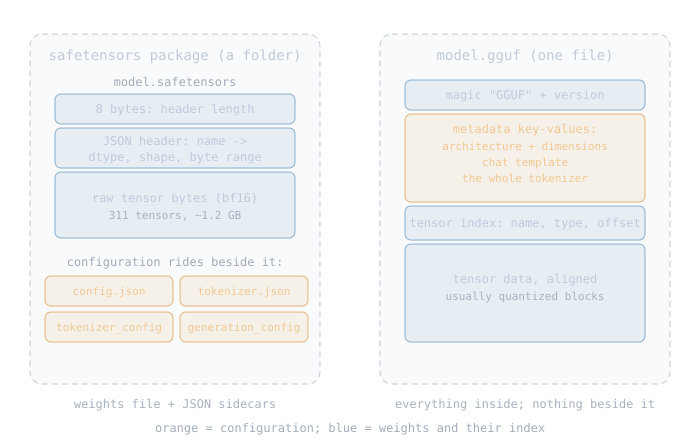

# Reading the Model

Before an engine supports a model, someone reads everything about it:
what the lab shipped, what is inside the files, which format to
consume, what every other engine does with it. This chapter is that
reading for Qwen3-0.6B, and the activity it teaches repeats for every
model this engine will ever support. It ends with the design decision
the reading forces: one conversion at the border, so the engine never
has to care about any of this again.

## 6.1 Models ship as families

- checkpoint: originally a weights snapshot saved during training so
  a run can resume; the ecosystem now uses the word for any saved
  weights, including the final released ones (a release is the last
  checkpoint that survived). In this book a checkpoint is a released
  model you can download. The real one:
  [Qwen/Qwen3-0.6B](https://huggingface.co/Qwen/Qwen3-0.6B) on
  Hugging Face (HF), the site checkpoints are distributed through.
- family: the architecture checkpoints share. The `model_type` field
  in config.json ("qwen3") names it.

Every lab ships this way — one family, sizes as checkpoints:

| lab | family (`model_type`) | checkpoints |
|---|---|---|
| Qwen | qwen3 (dense) | 0.6B, 1.7B, 4B, 8B, 14B, 32B |
| Qwen | qwen3_moe | routed-experts variants (separate family) |
| Meta | llama | Llama 3.1 at 8B, 70B, 405B |
| Google | gemma2 | Gemma 2 at 2B, 9B, 27B |

Support the family once and the whole size range runs; that is the
economics [The Engine](03-engine.md) built its two gates on.

## 6.2 The package on disk

A checkpoint's official release downloads as a folder
([browse Qwen3-0.6B's](https://huggingface.co/Qwen/Qwen3-0.6B/tree/main)):

| file | role |
|---|---|
| [config.json](https://huggingface.co/Qwen/Qwen3-0.6B/blob/main/config.json) (also as [raw JSON](https://huggingface.co/Qwen/Qwen3-0.6B/raw/main/config.json)) | the family name and every dimension number |
| model.safetensors | all 311 weight tensors, bf16, about 1.2 GB |
| tokenizer.json | the full tokenizer: vocab and merge rules |
| tokenizer_config.json | the chat template and special token names |
| generation_config.json | stop token ids and default sampling settings |

Each file feeds one engine block. nucleon will consume the GGUF
conversion of this package instead (one file; 6.5 says why), but the
release folder is where every piece is defined, and GGUF's metadata
mirrors exactly these files.

## 6.3 Nobody wrote a specification

config.json has no specification. No standards body, no list of legal fields, no stability promise: each lab ships whatever fields its architecture needs, and may add, rename, or repurpose them next release.

This is a large part of why engines are hard. They lag new models not because the math is secret, but because someone must read each new config and modeling code and rewire the engine to match. Every architecture, every time.

The same story holds for every json in the package. Each is written
by the HF stack when the lab saves its model, and the class that
writes it is the only schema it has:

| file | the class that writes it (= the schema) |
|---|---|
| config.json | the family's config class, picked by `model_type`: [Qwen3Config](https://huggingface.co/docs/transformers/model_doc/qwen3); the few fields every model shares come from the base class, [PretrainedConfig](https://huggingface.co/docs/transformers/main_classes/configuration) |
| generation_config.json | [GenerationConfig](https://huggingface.co/docs/transformers/main_classes/text_generation) — stop ids, default sampling |
| tokenizer_config.json | the tokenizer class's saved settings; the chat template is a string field in here |
| tokenizer.json | the [HF tokenizers library](https://huggingface.co/docs/tokenizers/index)'s own serialization (the one file with real documentation) |

Two follow-up questions, answered because later chapters depend on
them:

- where token ids come from: the lab assigns them when it freezes the
  vocab before training, and the model learns embeddings for exactly
  those ids. Qwen3 reserves 151643 upward for special tokens: 151643
  `<|endoftext|>`, 151644 `<|im_start|>`, 151645 `<|im_end|>`, and so
  on. Nothing about these numbers is standard; they are this family's
  training-time choices.
- where the meanings live: the files hold values; their semantics are
  defined by the family's modeling code,
  [modeling_qwen3.py](https://github.com/huggingface/transformers/blob/main/src/transformers/models/qwen3/modeling_qwen3.py).
  The model was trained with that code, so it outranks papers and
  blog posts when they disagree. Our family implementation is a Rust
  port of what that file actually does.

So reading the config is the first step of supporting any model,
every time, and it always carries surprises:

| model | config field | the surprise |
|---|---|---|
| Qwen3-0.6B | `head_dim: 128` | explicit, while hidden/heads = 64; compute it instead of reading it and every weight loads, then the model generates garbage |
| Qwen3.8-27B | `full_attention_interval: 4`, `partial_rotary_factor: 0.25` | same lab, one generation later: fields qwen3 never had |
| DeepSeek-V2-Lite | `q_lora_rank: null` | one nullable field switches a whole projection block off; the larger checkpoint of the same `model_type` has it on |

With no standard to fall back on, a value a file does not state is an
error, not a guess — a rule the gate chapter turns into code.

## 6.4 The formats

The same weights ship in several packagings. The full landscape, two
of which are lineages (pytorch .bin was replaced by safetensors;
GGML/GGJT by GGUF):

| format | from | since | shape | role for LLM weights today |
|---|---|---|---|---|
| pytorch .bin | PyTorch | 2016 | folder + sidecars | the old HF default; pickle-based, executes code on load; still on older repos |
| safetensors | Hugging Face | 2022 | folder + sidecars | the HF release default; labs publish in it |
| GGML / GGJT | llama.cpp | early 2023 | one file | GGUF's predecessors, superseded |
| GGUF | llama.cpp | Aug 2023 | one file | the local/quantized world's default |
| ONNX | Microsoft + Meta | 2017 | one graph file | cross-framework deployment; not how LLMs release weights |

(Names like GPTQ and AWQ on HF are not containers: they are
quantization methods, and those repos still ship safetensors files
holding the quantized values.)

The two lineage winners in detail; the difference is where the
configuration lives:

| | safetensors | GGUF |
|---|---|---|
| layout | 8 bytes of header length, JSON header (tensor name to dtype, shape, byte range), raw bytes | one self-describing file: metadata key-values plus tensors |
| weights held as | bf16 here (full precision) | usually quantized (reduced precision) |
| sits beside it | config.json, tokenizer files | nothing; metadata is inside |

One dtype word: bf16 is a 16-bit float with f32's exponent range and
fewer fraction bits; full-precision releases store weights in it.

Where the formats come from: safetensors is Hugging Face's own format, built in 2022 to replace pickle-based PyTorch checkpoint files, which can execute arbitrary code when loaded. Its reference implementation is written in Rust (<a href="https://huggingface.co/docs/safetensors/index">format docs</a>, <a href="https://github.com/huggingface/safetensors">source</a>).

GGUF comes from the llama.cpp project (August 2023, replacing its earlier GGML and GGJT files): one self-describing file carrying weights and all metadata as key-value pairs (dimensions, even the whole tokenizer), so nothing sits beside it. Unlike config.json, GGUF has an actual written <a href="https://github.com/ggml-org/ggml/blob/master/docs/gguf.md">specification</a>.

Can a loader know it is reading a version it supports? Depends on the
format:

| | version marker | what a loader can do |
|---|---|---|
| GGUF | explicit version field right after the magic bytes (3 today; the spec documents 1 to 3) | refuse unsupported versions with a clear error |
| safetensors | none; the layout has never changed | validate structure strictly instead |
| config.json | none for the schema; only `transformers_version` (4.51.0 in Qwen3-0.6B's), which records the library that wrote it, not what the fields mean | strict required fields: missing or unknown = error, which catches schema drift the file cannot announce |
| ONNX | an IR version plus per-operator-set versions | full version negotiation |

config.json's row is 6.3's warning again: a file with no schema has
nothing to version.

## 6.5 Who runs all this

The same released checkpoint gets run by very different engines.
They differentiate on three axes: which format they read, which
hardware they bet on, and what they optimize for.

| engine | from | reads | hardware | built for |
|---|---|---|---|---|
| transformers | Hugging Face | safetensors | CPU, CUDA, Apple MPS | the reference: every model, correctness first, speed last |
| llama.cpp | ggml community | GGUF | CPU, Metal, CUDA, Vulkan | runs anywhere, quantized, single binary |
| MLX | Apple | safetensors | Apple silicon only | unified-memory-native research and local use |
| vLLM | UC Berkeley origin | safetensors | server GPUs (CUDA, ROCm) | serving many requests at once |
| nucleon | this book | GGUF | Apple silicon (CPU + Metal) | readable pure Rust, every block a lesson |

Two rows explain nucleon's ancestry: llama.cpp proves a from-scratch
engine can match the labs, and MLX proves Apple silicon rewards an
engine built for unified memory. nucleon takes both bets in Rust —
and reads exactly one format, GGUF
([ADR 004](../decisions/004-gguf-only-engine.md)): the local world's
default, quantization native, official and community files for every
model we target.

## 6.6 One conversion, then never again

Everything above churns: labs add config fields, formats rise and
fall, quant types multiply. An engine coupled to any of it redoes
work on every release. nucleon's answer is a single conversion at a
single border:

1. a format is only an envelope. Any container from which a loader
   can recover three things — every tensor as (name, shape, dtype,
   bytes), the config numbers, the tokenizer — can feed the same
   engine;
2. so the loader converts, once, at startup: the supported format in,
   the engine's own in-memory bundle out. That bundle is a struct
   named `Yamf` — Yet Another Model Format, ironically, since it is
   not a format at all; the next chapter owns the joke — and inside
   the engine only Yamf exists: no module past the border ever sees
   a format;
3. a new format therefore costs one adapter at the border and zero
   engine changes. Today there is one adapter (GGUF); the
   architecture does not care how many there ever are.

How that conversion actually works — the bytes, the checks, the
refusals, and Yamf itself — is the next chapter.

## 6.7 Upcoming reading topics

Readings this book will do again, each feeding a later chapter:

1. Qwen3.8-27B's release: 18 shards, hybrid layers, an MTP head to
   skip ([Qwen3.8, the hybrid](13-qwen38.md));
2. quantized variants beyond Q8_0, for Part III
   ([Quantization](12-quantization.md));
3. a release with no llama.cpp port to lean on: reading a family
   nobody has converted yet.

Next: [The Loader](04-loader.md).
