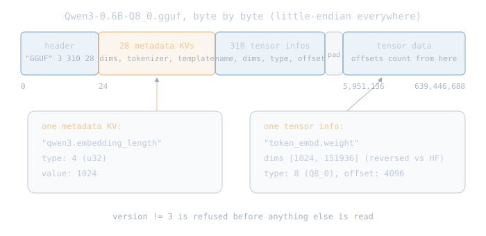

# The Loader

The first block of Part II. It runs once, at startup, and crosses the
border drawn in [The Engine](03-engine.md): one GGUF file on one
side, the engine's plain types on the other. This chapter is the
design; the build follows it. Every number below was verified against
the real file's bytes (docs/research/gguf-qwen3.md carries the
sources).

## 6.1 The job

<div class="diagram"></div>

- in: one file, `Qwen3-0.6B-Q8_0.gguf` (639,446,688 bytes);
- out: a config struct of numbers, and a map from tensor name to our
  f32 `Tensor`, every shape already checked;
- guarantee: nothing past the loader can tell how weights were
  stored. GGUF is the only format
  ([ADR 004](../decisions/004-gguf-only-engine.md)); the parser is
  nucleon's own code, not a dependency.

Fetch the file once before the build:

```bash
hf download Qwen/Qwen3-0.6B-GGUF --local-dir models/qwen3-0.6b-gguf
```

`models/` stays out of git; unit tests never touch it.

## 6.2 The container, byte by byte

<div class="diagram"></div>

Everything is little-endian. The file opens with a fixed header:

| offset | field | type | this file |
|---|---|---|---|
| 0 | magic | 4 bytes | "GGUF" |
| 4 | version | u32 | 3 (anything else: refuse) |
| 8 | tensor_count | u64 | 310 |
| 16 | metadata_kv_count | u64 | 28 |

Then `metadata_kv_count` key-value pairs, then `tensor_count` tensor
infos, then zero-padding to the alignment (32 unless the metadata says
otherwise; 28 pad bytes here), then the tensor data region, which
starts at byte 5,951,136 in this file.

Naming collision warning: "KV" here means key-value pair, a named
entry in the file's dictionary. It has nothing to do with the KV
cache from [the map chapter](00-big-picture.md#12-the-kv-cache),
which is runtime memory of attention key and value vectors; that
cache does not exist until generation runs.

The building blocks:

- string: a u64 byte length, then that many UTF-8 bytes, never
  null-terminated. Lengths are bounds-checked against the file before
  any allocation;
- metadata value: a u32 type id, then the value. Type ids 0 to 12:
  u8/i8, u16/i16, u32/i32, f32, bool (a byte that must be 0 or 1),
  string, array (element type id + u64 count + packed values,
  nestable), u64/i64, f64;
- tensor info: name (string, max 64 bytes), n_dimensions (u32, max
  4), the dimensions as u64s, a u32 ggml type id (F32 = 0, Q8_0 = 8),
  and a u64 offset relative to the data region's start, which must be
  a multiple of the alignment.

One version note for the error message: v1 encoded string lengths as
u32, v2 widened them to u64, v3 added big-endian support with
identical structure. A big-endian file has no marker; it reveals
itself by version reading as 50,331,648 instead of 3, and the parser
refuses it by value.

## 6.3 The metadata this file carries

All 28 keys are enumerated in the research doc; the ones the loader
reads for the config:

| GGUF metadata key | value | Qwen3Config field |
|---|---|---|
| general.architecture | "qwen3" | checked, not stored |
| qwen3.block_count | 28 | num_hidden_layers |
| qwen3.embedding_length | 1024 | hidden_size |
| qwen3.feed_forward_length | 3072 | intermediate_size |
| qwen3.attention.head_count | 16 | num_attention_heads |
| qwen3.attention.head_count_kv | 8 | num_key_value_heads |
| qwen3.attention.key_length | 128 | head_dim (no head_dim key exists; key_length carries it) |
| qwen3.attention.layer_norm_rms_epsilon | 1e-6 (an f32; parse it as f32) | rms_norm_eps |
| qwen3.rope.freq_base | 1000000.0 | rope_theta |
| qwen3.context_length | 40960 | max_position_embeddings |
| tokenizer.ggml.eos_token_id | 151645 | eos_token_id |

Absent keys get spec defaults or nothing: `general.alignment` absent
means 32; there is no vocab_size key, the tokens array's length
(151,936) is the vocab size. Missing required keys are errors; keys
appear in any order, so the parser matches by name, never by
position.

The rest of the metadata feeds later blocks: the tokenizer arrays
(tokens, merges, token_type — rebuilt into a tokenizer in
[The Tokenizer](05-tokenizer.md)) and a 4100-character ChatML chat
template string ([The CLI](10-cli.md)).

One landmine flagged now because it costs a debugging day later:
`tokenizer.ggml.bos_token_id` exists (151643) while
`tokenizer.ggml.add_bos_token` is false. Qwen3 never prepends BOS;
reading the id and "helpfully" using it changes every output.

## 6.4 The tensors

310 tensors: 2 global + 28 layers x 11. The 197 matmul weights are
Q8_0; the 113 one-dimensional norm weights stay F32 (the file's own
`general.file_type = 7` means "mostly Q8_0, except 1-d tensors").

| GGUF name | dims (as stored) | type | HF equivalent |
|---|---|---|---|
| token_embd.weight | [1024, 151936] | Q8_0 | model.embed_tokens.weight |
| output_norm.weight | [1024] | F32 | model.norm.weight |
| blk.N.attn_norm.weight | [1024] | F32 | input_layernorm |
| blk.N.attn_q.weight | [1024, 2048] | Q8_0 | q_proj |
| blk.N.attn_k.weight | [1024, 1024] | Q8_0 | k_proj |
| blk.N.attn_v.weight | [1024, 1024] | Q8_0 | v_proj |
| blk.N.attn_q_norm.weight | [128] | F32 | q_norm |
| blk.N.attn_k_norm.weight | [128] | F32 | k_norm |
| blk.N.attn_output.weight | [2048, 1024] | Q8_0 | o_proj |
| blk.N.ffn_norm.weight | [1024] | F32 | post_attention_layernorm |
| blk.N.ffn_gate.weight | [1024, 3072] | Q8_0 | mlp.gate_proj |
| blk.N.ffn_up.weight | [1024, 3072] | Q8_0 | mlp.up_proj |
| blk.N.ffn_down.weight | [3072, 1024] | Q8_0 | mlp.down_proj |

Two traps, both fatal and both silent if missed:

1. dims are REVERSED relative to HF: dims[0] is the contiguous
   dimension (the row length). `token_embd.weight` is stored
   [1024, 151936] where HF says [151936, 1024]. The loader reverses
   into our row-major shape; forgetting this transposes the entire
   model and produces fluent garbage;
2. there is NO `output.weight` in this file. The lm head is tied:
   logits come from `token_embd.weight`, reused by reference, not
   copied. llama.cpp does exactly this fallback.

## 6.5 Q8_0, the first quant type

```text
one block: 34 bytes, 32 values

[ d: f16 ][ q0 | q1 | ... | q31 : i8 each ]

value_j = f32(d) * q_j
```

A row of k elements is k/32 consecutive blocks (every Q8_0 tensor
here has k a multiple of 32). The scale `d` is an IEEE 754 half; the
half crate converts it, which is why that dependency exists. At load,
each block dequantizes to 32 f32 values; computing on packed blocks
directly is Part III's fused-kernel work.

The layout rules can be proven from the file with plain arithmetic:
token_embd at offset 4096 occupies 151936 x 1024 / 32 blocks x 34
bytes = 165,306,368, ending exactly at the next tensor's offset; the
last tensor's end lands exactly at byte 639,446,688, the file size.
The loader's tests pin this arithmetic.

## 6.6 The config struct

`Qwen3Config` is filled from the metadata table in 6.3: typed values
read by key name, no JSON anywhere. Missing key, wrong type, or
`general.architecture != "qwen3"` each refuse with a named error.

> **Rust: `Result<T, E>` and `?`.** A function that can fail returns
> `Result`: `Ok(value)` or `Err(error)`; `?` unwraps the `Ok` or
> returns the `Err` to the caller early. Sibling: `Option<T>` for
> absence without an error. [The Book, ch. 9.2](https://doc.rust-lang.org/book/ch09-02-recoverable-errors-with-result.html)

## 6.7 Errors and the strict contract

The world can fail (files are the world), so loading returns
`Result<_, LoaderError>`; panics stay reserved for caller bugs, the
rule Tensor 0 set.

> **Rust: `enum` and `match`.** An enum value is exactly one of its
> listed variants, each optionally carrying data; `match` forces
> handling every variant. Sibling: `if let` for one-variant checks.
> [The Book, ch. 6](https://doc.rust-lang.org/book/ch06-00-enums.html)

Every variant carries what was found AND what is supported, so the
refusal message doubles as compatibility documentation:

| check | refusal |
|---|---|
| magic | "not a GGUF file" |
| version | "GGUF version {found}; nucleon supports 3" |
| general.architecture | "architecture {found}; nucleon supports: qwen3" |
| tensor type | "{name} is {type}; supported: F32, Q8_0" |
| metadata | "missing key {key}" / "key {key} has type {found}, expected {want}" |
| structure | out-of-bounds string length or tensor offset, misaligned offset, overlapping ranges, bool byte not 0/1 |

The contract on what a loaded model must contain:

1. exactly the expected tensor set, generated from block_count: 2
   global + 28 x 11 = 310 names, each with the exact (reversed,
   checked) shape; missing or extra tensors are errors by name;
2. dims reversed into row-major shapes before any shape check;
3. Q8_0 dequantized to f32 once, during the single pass over the
   mmap; F32 tensors copied straight out;
4. logits weight = the embedding tensor, by reference (6.4 trap 2).

mmap carries over from the safetensors design unchanged: the OS pages
the file in as it is touched, and the mapping is `unsafe` (the box is
in [Metal 0](02-metal.md)) because Rust cannot prove the file stays
unmodified; our invariant is a local file nobody rewrites mid-run.

## 6.8 The API

```rust
pub struct LoadedModel {
    pub config: Qwen3Config,
    pub tensors: HashMap<String, Tensor>,
}

pub fn load(path: &Path) -> Result<LoadedModel, LoaderError>
```

> **Rust: `HashMap<K, V>`.** The standard hash table: owned keys to
> owned values, `get` returns `Option`. Sibling: `BTreeMap` when
> iteration order matters. [std docs](https://doc.rust-lang.org/std/collections/struct.HashMap.html)

Module layout, one concern per file, each with sibling tests:

| file | concern |
|---|---|
| loader/mod.rs | export barrel only |
| loader/container.rs | 6.2: header, metadata KVs, tensor infos, alignment |
| loader/config.rs | 6.3: metadata keys to Qwen3Config |
| loader/dequant.rs | 6.5: Q8_0 blocks to f32 |
| loader/model.rs | 6.7: expected names, checks, LoadedModel |

The parser existing also makes `nucleon inspect model.gguf` nearly
free: print version, architecture, dimensions, tensor types, and a
supported/not verdict per check. It lands with the CLI chapter.

## 6.9 What the tests will pin

All on synthetic GGUF files the tests write themselves; no network,
no 640 MB fixture:

1. happy path: a tiny hand-built file (two tensors, one Q8_0, one
   F32) round-trips with exact values;
2. every refusal in 6.7's table, one test each: wrong magic, version
   2 and the big-endian 50,331,648, foreign architecture, Q4_K
   tensor, missing/extra/mistyped metadata keys, lying string
   lengths, misaligned and out-of-bounds offsets, a bool byte of 7;
3. the dims-reversal pin: a [rows, cols] tensor written GGUF-style
   loads with our row-major shape and correct element order;
4. Q8_0 dequant spot values, with fixtures quantized by the reference
   formula (d = amax/127, values rounded), so both directions are
   bit-exact;
5. the epsilon f32 pin: 1e-6 read back must equal the f32 bit
   pattern, not a f64 approximation;
6. the oracle cross-check: the same synthetic files read through
   candle-core (dev-dependency only): header fields, metadata, and
   dequantized values must agree with ours.

The golden test (whole-engine, real file) stays in The Loop's
chapter: HF transformers 4.54.0 or newer loads this exact GGUF via
`gguf_file=`, dequantizes to f32 the same way, and its greedy token
ids become the ids nucleon must reproduce.

## 6.10 Upcoming loader topics

1. Q4_K and friends: more block layouts in dequant.rs (Part III);
2. fused dequant: weights stay packed in the map, kernels read blocks
   directly, dequant-on-load's memory cost disappears (Part III);
3. split GGUF: large models ship as `-00001-of-000NN.gguf` parts; the
   27B needs the multi-file reader;
4. a safetensors adapter, only if a future ADR reopens ADR 004.

Next: the build, test-first, starting with container.rs.
