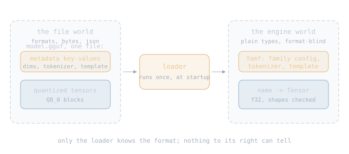
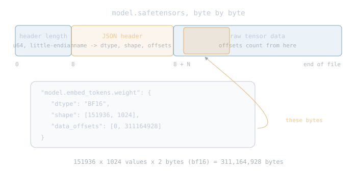

# The Loader

The first block of Part II. It runs once, at startup, and crosses the
border drawn in [The Engine](03-engine.md): the file world on one
side, the engine's plain types on the other. This chapter is the
design; the build follows it.

## 6.1 The job

<div class="diagram"></div>

- in: a checkpoint folder (config.json, model.safetensors);
- out: a config struct of numbers, and a map from tensor name to our
  f32 `Tensor`, every shape already checked;
- guarantee: nothing past the loader can tell which format the
  weights came from. A new format is a new adapter inside the loader
  with identical output ([ADR 003](../decisions/003-quantized-weights-gguf-only.md)
  froze the adapter list at two: safetensors here, GGUF in Part III).

Fetch the package once before the build (about 1.4 GB):

```bash
hf download Qwen/Qwen3-0.6B --local-dir models/qwen3-0.6b
```

`models/` stays out of git; tests never touch it.

## 6.2 safetensors, byte by byte

<div class="diagram"></div>

Reading it is four steps:

1. read 8 bytes: `N`, the JSON header's length, as a little-endian
   u64;
2. read `N` bytes: the JSON header, mapping each tensor name to its
   `dtype`, `shape`, and `data_offsets` (begin and end);
3. everything after byte `8 + N` is the data region; each tensor's
   `data_offsets` count from the region's start, not the file's;
4. one special header key, `__metadata__`, holds free-form strings;
   allowed and ignored.

We parse this by hand: it is about forty lines, and the format is the
point of the chapter. Hugging Face's own `safetensors` crate enters
only as a dev-dependency, generating oracle files the tests compare
our parser against.

## 6.3 mmap: the file as memory

The weights file is 1.2 GB. Instead of reading it into a buffer, the
loader memory-maps it: the operating system makes the file appear as
a byte slice in our address space and pulls 16 KB pages off disk only
when code first touches them.

Three OS words, with references:

1. virtual memory: every process sees its own private address space,
   translated to physical RAM by the hardware
   ([reference](https://man7.org/linux/man-pages/man2/mmap.2.html));
2. page: the granule of that translation, 16 KB on Apple silicon;
3. page cache: file bytes the OS already holds in RAM; a mapped page
   already in cache costs no disk read at all.

Honesty about the win here: M1 touches every byte anyway (bf16 to f32
conversion), so mapping saves one full copy and some allocation, not
the read itself. The real payoff is deferred: in Part III quantized
blocks are computed from directly, and the mapping means weights that
never get touched never get loaded.

Mapping is `unsafe` (the box is in [Metal 0](02-metal.md)): Rust
cannot prove the file will not change under the map while we read it.
The crate for this is memmap2; our stated invariant is a local model
file nobody rewrites mid-run.

## 6.4 The config struct

config.json parses into exactly the fields the family needs, via
serde (nucleon's first external dependencies appear in this chapter:
serde, serde_json, memmap2, half — all pure Rust):

| Qwen3Config field | from 5.2's table |
|---|---|
| num_hidden_layers | 28 |
| hidden_size | 1024 |
| num_attention_heads / num_key_value_heads | 16 / 8 |
| head_dim | 128 |
| intermediate_size | 3072 |
| vocab_size | 151936 |
| rope_theta / rms_norm_eps | 1e6 / 1e-6 |
| tie_word_embeddings | true |
| eos_token_id | 151645 |

> **Rust: `Result<T, E>` and `?`.** A function that can fail returns
> `Result`: `Ok(value)` or `Err(error)`; `?` unwraps the `Ok` or
> returns the `Err` to the caller early. Sibling: `Option<T>` for
> absence without an error. [The Book, ch. 9.2](https://doc.rust-lang.org/book/ch09-02-recoverable-errors-with-result.html)

Two deliberate strictness choices, one per direction:

- unknown config keys are ignored: real configs carry fields for
  other tools (vision blocks, training leftovers); requiring our
  subset only is what lets one struct read every qwen3 size;
- missing required keys are errors, and `model_type` must equal
  "qwen3": no defaults, per the no-spec warning in The Engine (5.3).

## 6.5 Errors: the LoaderError enum

The world can fail (files are the world), so loading returns
`Result<_, LoaderError>`; panics stay reserved for caller bugs, the
rule Tensor 0 set.

> **Rust: `enum` and `match`.** An enum value is exactly one of its
> listed variants, each optionally carrying data; `match` forces
> handling every variant. Sibling: `if let` for one-variant checks.
> [The Book, ch. 6](https://doc.rust-lang.org/book/ch06-00-enums.html)

The variants are the failure stories of 6.2 and 6.4, each carrying
what a person needs to debug it: which file, which tensor name, which
shape was expected against which was found. The exact list lands with
the code; `Display` is implemented by hand rather than through an
error-helper crate, because reading it is the lesson.

## 6.6 The strict contract

The loader validates everything the format cannot promise:

1. every tensor the config implies must be present with the exact
   expected shape. The expected list is generated from the config,
   and the arithmetic is a pleasing check: 3 global tensors (embed,
   final norm, lm_head) + 28 layers x 11 per-layer tensors = 311,
   the file's exact count;
2. a tensor the config does not explain is an error, with one
   exception: the tied lm_head copy Qwen3-0.6B ships byte-identical
   to the embedding table;
3. every `data_offsets` range is bounds-checked against the data
   region, sizes are checked-multiplied, ranges must not overlap;
4. bf16 becomes f32 once, during the copy out of the map (the half
   crate does the numeric conversion).

Why this hardness, restated from The Engine: a wrong weight does not
crash; it generates fluent garbage. Load time is the last moment a
mistake is cheap.

## 6.7 The API

The design the build must produce (signatures, not code yet):

```rust
pub struct LoadedModel {
    pub config: Qwen3Config,
    pub tensors: HashMap<String, Tensor>,
}

pub fn load(dir: &Path) -> Result<LoadedModel, LoaderError>
```

> **Rust: `HashMap<K, V>`.** The standard hash table: owned keys to
> owned values, `get` returns `Option`. Sibling: `BTreeMap` when
> iteration order matters. [std docs](https://doc.rust-lang.org/std/collections/struct.HashMap.html)

Module layout, one concern per file, each with its sibling tests:

| file | concern |
|---|---|
| loader/mod.rs | export barrel only |
| loader/config.rs | config.json to Qwen3Config |
| loader/safetensors.rs | the byte format of 6.2 |
| loader/model.rs | the contract of 6.6: expected names, checks, LoadedModel |

One family today means the loader names `Qwen3Config` directly; when
family two arrives, config typing moves behind the family seam and
this chapter gets its sequel.

## 6.8 What the tests will pin

All on synthetic files the tests write themselves; no network, no
1.2 GB fixture:

1. happy path: a two-tensor file round-trips with exact values;
2. truncated file, header length lying about `N`;
3. header that is not JSON, dtype we do not support;
4. missing tensor, unexpected tensor, wrong shape;
5. offsets out of bounds, overlapping, or overflowing a usize;
6. bf16 conversion spot-checks (1.0, -2.5, the largest normal);
7. oracle cross-check: a file written by the official safetensors
   crate parses identically through ours.

## 6.9 Upcoming loader topics

1. index.json sharding: the 27B ships as 18 files (its chapter);
2. the GGUF adapter: same output, new bytes, plus name translation
   (Part III, ADR 003);
3. dtype-preserving load: bf16 and quantized blocks staying packed
   instead of becoming f32 (Part III);
4. zero-copy f32: pointing Tensors at the map instead of copying,
   alignment permitting.

Next: the build, test-first, starting with the byte parser of 6.2.
