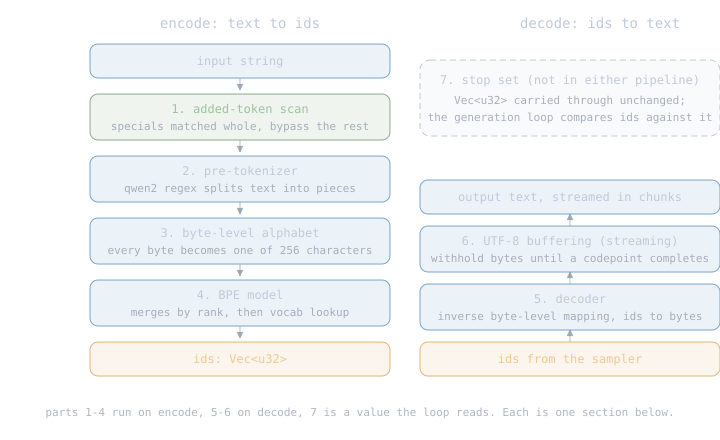
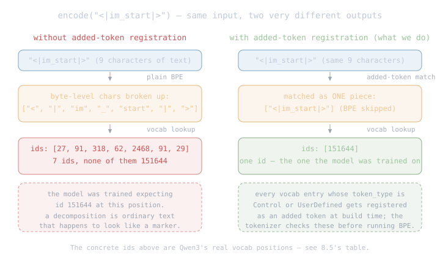
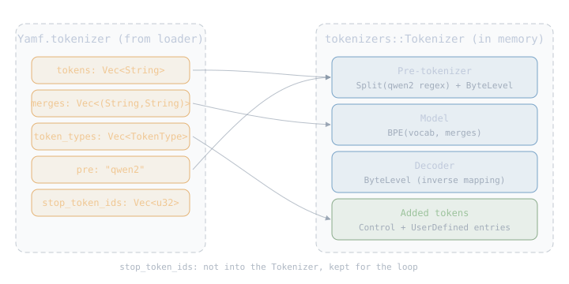
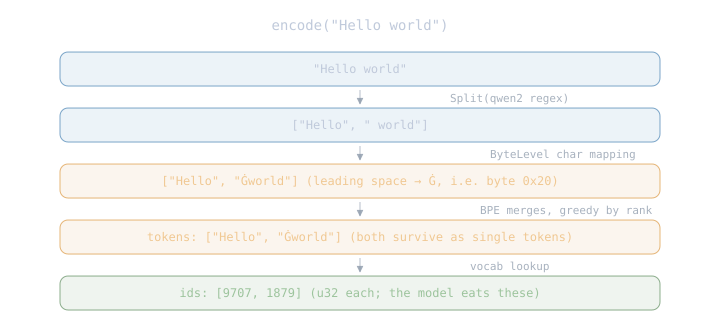
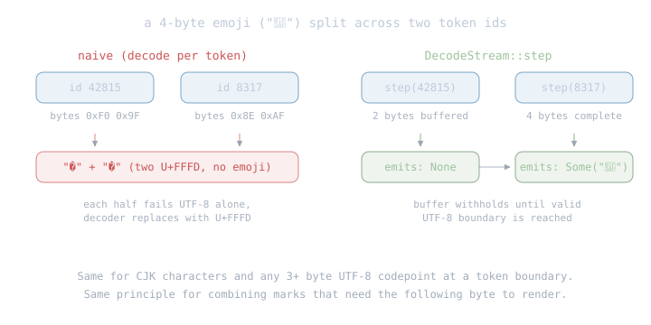

# The Tokenizer

The border between two representations. Every step of generation
that touches the user speaks strings; every step inside the engine
speaks integer ids. The tokenizer runs both directions:

- **encode**: the user's text (or the ChatML-wrapped prompt the
  chat template built) becomes a `Vec<u32>` of ids for the model.
- **decode**: the ids the sampler emits become text, streamed to
  the user one chunk at a time.

Nothing about the tokenizer is family-generic today: it is the
Qwen3 byte-level BPE tokenizer, reconstructed from what the loader
already validated and put in `Yamf`
([The Loader](04-loader.md), 7.8). When a second family arrives, the
reconstruction chooses a different pre-tokenizer regex; the rest of
this chapter stays the same.

## 8.1 The parts

Seven parts, and the whole chapter is just these seven explained.
Parts 1-4 run on encode, 5-6 on decode, 7 is a value the generation
loop reads:

<div class="diagram"></div>

| # | part | job in one line |
|---|---|---|
| 1 | added-token scan | match special tokens whole, before anything else touches them |
| 2 | pre-tokenizer | split raw text into pieces with the qwen2 regex |
| 3 | byte-level alphabet | turn every byte into one of 256 characters, so nothing is unencodable |
| 4 | BPE model | merge characters into tokens by rank, look up their ids |
| 5 | decoder | ids back to bytes (the alphabet's inverse) |
| 6 | UTF-8 buffering | hold decoded bytes until they form a whole codepoint (streaming) |
| 7 | stop set | the ids that end generation, carried through for the loop |

The sections below explain each part, simplest first: the stop set
(8.2), the alphabet (8.3), the BPE model (8.4), the regex (8.5),
and the specials behind the added-token scan (8.6). Then assembly
from `Yamf` (8.7), the two runtime paths end to end (8.8, 8.9),
and the API (8.10).

## 8.2 The stop set

The simplest part (7 in the diagram) — it is not even logic, just
a value passed through. The loader assembled `stop_token_ids` for us (7.3
landmine 2: `eos_token_id` alone under-reports; `<|endoftext|>`
must be added by string lookup). The tokenizer stores it and
returns it verbatim: `Tokenizer::stop_token_ids() -> &[u32]`.
Comparing each sampled id against this set — and stopping — is
the generation loop's job, not ours.

## 8.3 The byte-level alphabet

**Byte-level** means the base alphabet is exactly 256 characters —
one per possible byte — so any input string can encode. Nothing is
"out of vocabulary." The 256 characters are not the raw bytes:
printable bytes map to themselves, and the rest get a sequential
codepoint from `U+0100` upward (the loader chapter's
`byte_level_char` is the exact function; the gate already verified
all 256 are in the vocab). One mapping worth memorizing: byte
`0x20` (space) is not printable in a token string, so it maps to
`Ġ` — that is why a leading-space word shows up as `Ġworld` in
every BPE vocab dump you will ever read.

## 8.4 The BPE model

BPE (byte-pair encoding) merges the most frequent adjacent pair of
tokens into a new token, over and over, until the vocab is full. At
encode time, the same merges run in the same order, greedily. The
full walkthrough with visualizations and every tokenizer variant
(BPE, WordPiece, SentencePiece, byte-level) sits in the
[LLM Lab tokenizing chapter](https://llm-lab.bicepjai.com/llm-tokenizing/);
read that first if the algorithm is new.

What the model is made of, for us: two values the loader already
carries in `Yamf`:

- `tokens: Vec<String>` — the vocab; a token's id is its index.
- `merges: Vec<(String, String)>` — the merge rules. **Order is
  rank**: when two merges are candidates at the same position, the
  one earlier in this list wins. The loader kept file order, so
  rank is index — no sorting, no extra bookkeeping.

## 8.5 The pre-tokenizer regex

Before BPE runs, the raw string is split into pieces, and merges
never cross piece boundaries. Which regex does the splitting is a
per-family choice; `Yamf.tokenizer.pre == "qwen2"` names this one.
It was verified against Qwen's real `tokenizer.json` and
llama.cpp's `LLAMA_VOCAB_PRE_TYPE_QWEN2` during the research pass
(docs/research/gguf-qwen3.md section 7 quotes both):

```text
(?i:'s|'t|'re|'ve|'m|'ll|'d)|
[^\r\n\p{L}\p{N}]?\p{L}+|
\p{N}|
 ?[^\s\p{L}\p{N}]+[\r\n]*|
\s*[\r\n]+|
\s+(?!\S)|
\s+
```

Seven alternatives, first match wins at each position:

| alternative | matches | example |
|---|---|---|
| `(?i:'s\|'t\|'re\|'ve\|'m\|'ll\|'d)` | English contractions | the `'s` in `it's` |
| `[^\r\n\p{L}\p{N}]?\p{L}+` | a letter run, optionally led by one symbol | ` world`, `#hash` |
| `\p{N}` | ONE digit at a time | `7`, then `6` in `76` |
| ` ?[^\s\p{L}\p{N}]+[\r\n]*` | a symbol run, optional leading space | ` ->`, `!!!` |
| `\s*[\r\n]+` | newlines with surrounding blank space | a paragraph break |
| `\s+(?!\S)` | whitespace NOT followed by non-space | trailing spaces at line end |
| `\s+` | any remaining whitespace | the gap between pieces |

Two Rust-specific notes:

- Every alternative needs Unicode property support (`\p{L}` letters,
  `\p{N}` digits), and the sixth has a lookahead `(?!\S)`. The
  default `regex` crate cannot do lookaheads. `fancy-regex` (pure
  Rust) can, and is our chosen backend.
- The tokenizers crate default features are `["progressbar", "onig",
  "esaxx_fast"]`; `onig` binds the C library Oniguruma. Depend on it
  with `default-features = false, features = ["fancy-regex"]`.

## 8.6 Special tokens and the added-token scan

A **special token** is a vocabulary entry whose string form is a
marker the model was trained to recognize as structure, not as
literal text. Qwen3 has three that matter now, four more that show
up under tools/thinking modes, and a `token_type` on each so the
tokenizer knows how to treat them:

| id | string | token_type | what it means |
|---|---|---|---|
| 151643 | `<\|endoftext\|>` | Control | end of the whole generation (stop the loop) |
| 151644 | `<\|im_start\|>` | Control | ChatML: a message begins |
| 151645 | `<\|im_end\|>` | Control | ChatML: this message ended (also stops decode of assistant turn) |
| 151657 | `<tool_call>` | UserDefined | tools mode: model requests a tool call |
| 151658 | `</tool_call>` | UserDefined | tools mode: end of the request |
| 151667 | `<think>` | UserDefined | thinking mode: model's private scratch space starts |
| 151668 | `</think>` | UserDefined | thinking mode: end of scratch |

Two things about specials that trip everyone up. Both are shown
side by side in the diagram below.

**They must encode as ONE id.** The string `<|im_start|>` is nine
characters. If we hand it to plain BPE without telling the tokenizer
about it, BPE splits it into whatever byte-level merges cover
`<`, `|`, `im`, `_`, `start`, `|`, `>` — several ids, none of them
151644. The model was trained expecting id 151644, so a decomposed
form is *not the same input* — it's ordinary text that happens to
look like the marker. Registering the string as an "added token"
makes the tokenizer match it whole — the part-1 scan runs before
the pre-tokenizer or BPE ever see the text — and emit exactly one
id.

<div class="diagram"></div>

**Encode does not add them for us.** The tokenizers crate has a
convenience where `encode(text, add_special_tokens=true)` sprinkles
BOS at the start / EOS at the end automatically. We turn that OFF:
`encode(text, add_special_tokens=false)`. Why: the **chat template**
already built the specials into the string. If the tokenizer also
inserted them, every one doubles. Qwen3 explicitly does not want a
BOS at all; `add_bos_token=false` in the metadata (the loader gates
on it). Concrete example:

```text
one turn of chat, before the tokenizer sees anything:

  messages = [{"role": "user", "content": "Why is the sky blue?"}]

the chat template renders that to a plain string:

  <|im_start|>user\nWhy is the sky blue?<|im_end|>\n<|im_start|>assistant\n

that string is what encode() gets. Every <|im_start|>, <|im_end|>
in it is one id (added-token match); the rest goes through byte-level
BPE like any other prose.
```

If the tokenizer added its OWN BOS on top of this, the model would
see `<|im_start|><|im_start|>user...` — two openers, one from us and
one from the template, and the model was never trained on that.

Where each rule is enforced:

| the rule | enforced where |
|---|---|
| `<\|im_start\|>` encodes as one id, not seven | the reconstruction registers every Control/UserDefined/Unknown vocab entry as an added token (8.7) |
| encode does not sprinkle BOS/EOS | our `encode()` passes `add_special_tokens=false` (8.8) |
| add_bos_token / add_eos_token are false in the file | the loader refuses any file that sets them true (7.7) |
| the ChatML wrapping is correct | the loader's render smoke test in the gate (7.7) checked both roles and both markers in order on a real render |

## 8.7 Assembling the parts from `Yamf`

Every part above is built from a field the loader already
validated. The gate work that makes this section short: 256
byte-level base tokens present and typed `Normal`; every merge
references vocab entries that exist and are `Normal`; the tokenizer
model is `"gpt2"` and the pre id is `"qwen2"` — anything else was
refused by name; the three Control specials present and referenced
correctly by `eos_token_id`; `add_bos_token`/`add_eos_token` false
or absent. So for loader-produced bundles the checks below can never fire.
But `Yamf`'s fields are public — a hand-built bundle skips the gate
— so `from_yamf` re-validates its own border and refuses rather
than build a silently-corrupting tokenizer: parallel tokens/types
arrays, no duplicate token strings, the full 256-character byte
alphabet present and Normal-typed, merge operands and products
Normal-typed, and a pre id it has a regex for. These are not
redundant with the loader's gate; they are the module's own door.

The construction uses Hugging Face's `tokenizers` crate
(default-features off, `fancy-regex` on, per 8.5):

<div class="diagram"></div>

| Yamf field | becomes part | via |
|---|---|---|
| `tokens` (151936 entries) | 4. BPE model (vocab side) | `BpeBuilder::vocab_and_merges` |
| `merges` | 4. BPE model (merge side) | same builder; index = rank |
| `pre` (`"qwen2"`) | 2. pre-tokenizer | selects the regex constant |
| `token_types` (Control/UserDefined/Unknown) | 1. added-token scan | `AddedToken` registration |
| `tokens` again | 3. alphabet + 5. decoder | `ByteLevel` pre-tokenizer stage and `ByteLevel` decoder |
| `stop_token_ids` | 7. stop set | stored on our wrapper, untouched |

In HF-crate terms the assembled object has four layers plus the
added tokens:

1. **Normalizer** — `NFC`. The reference tokenizer.json carries it,
   but GGUF has no field for a normalizer, so `from_yamf` pins it
   the same way it pins the regex. Without it, decomposed Unicode
   input (an `e` followed by a combining acute — routine on macOS)
   tokenizes to ids the model never saw in training.
2. **Pre-tokenizer** — two stages, chained: `Split` with the qwen2
   regex, then `ByteLevel` with `add_prefix_space=false`,
   `trim_offsets=false`, `use_regex=false` (the regex already ran
   in Split).
3. **Model** — `BPE` from `(vocab, merges)`. No unk token, no
   byte-fallback, no ignore-merges: the byte-level alphabet gives
   every input a path.
4. **Decoder** — `ByteLevel` with the same flags, the inverse
   mapping back to bytes.

Part 6 (UTF-8 buffering) is not built here — it is a per-generation
object the decode path creates on demand (8.9).

## 8.8 Encode, end to end

Parts 1-4 in action on a two-word prompt:

<div class="diagram"></div>

Our `encode` wraps the HF call and hides the boolean —
`tokenizer.encode_fast(text, /*add_specials=*/ false)` — so callers
cannot accidentally turn special-sprinkling back on (8.6's second
rule). One defensive bound: inputs over 512 KiB are refused. The
regex backend's backtracking limit trips silently at about a
million whitespace characters — the crate swallows the error and
the whole input becomes one unsplit piece, wrong ids with no
failure — so `encode` refuses loudly long before that point (the
model's whole context window is about 160 KB of text).

The encoding case the tests pin explicitly: a ChatML-wrapped
prompt containing `<|im_start|>user\n...` must keep every marker
as one id (the added-token id 151644), never the BPE decomposition
of the literal string — the "one id, not seven" case from 8.6, in
a test. (Split codepoints are a decode-side concern: encode input
is a Rust `&str`, which is always whole UTF-8 by construction; the
splitting happens when the MODEL emits token ids, which is 8.9's
problem.)

## 8.9 Streaming decode without broken UTF-8

Parts 5 and 6 in action. Generation emits one token id per step. If
we decode each id in isolation and print, a multi-byte codepoint
(an emoji, a CJK character) whose UTF-8 bytes fall across two token
boundaries prints as `U+FFFD` (the replacement character) followed
by the missing continuation. The user sees garbage.

`tokenizers::DecodeStream` is part 6: it buffers bytes that do not
yet form a valid UTF-8 codepoint, waits for the next token, and
emits nothing until the buffer is a clean string.

<div class="diagram"></div>

The API we expose: `Tokenizer::stream_decoder(&self) -> DecodeStream`,
then `stream.step(id) -> Result<Option<String>, _>` — `None` while
buffering, `Some(chunk)` when a valid piece emerges. The generation
loop calls this in the sample-then-print inner loop.

One case `step` alone cannot handle: generation that ENDS while
bytes are still buffered — a max-token stop landing mid-emoji. The
HF stream has no flush, so those bytes would vanish silently. Our
wrapper tracks the ids fed since the last emitted chunk and adds
`finish()`: called when generation ends, it decodes whatever is
still buffered, lossily (a truncated codepoint prints as U+FFFD —
visible truncation, never silent loss), or returns `None` if the
stream ended clean. The loop's contract: every `stream_decoder()`
ends with a `finish()`.

## 8.10 The API

```rust
pub struct Tokenizer {
    inner: tokenizers::Tokenizer,     // HF crate, wrapped: parts 1-5
    stops: Vec<u32>,                  // part 7, pass-through
    vocab_len: usize,                 // tokens.len() at build; the
                                      // crate's get_vocab_size clones
                                      // the whole vocab per call
}

pub fn from_yamf(y: &Yamf) -> Result<Tokenizer, TokenizerError>;

impl Tokenizer {
    pub fn encode(&self, text: &str) -> Result<Vec<u32>, TokenizerError>;
    pub fn decode(&self, ids: &[u32]) -> Result<String, TokenizerError>;
    pub fn stream_decoder(&self) -> DecodeStream;   // part 6, on demand
    pub fn stop_token_ids(&self) -> &[u32];
    pub fn vocab_size(&self) -> usize;
}

impl DecodeStream<'_> {
    pub fn step(&mut self, id: u32) -> Result<Option<String>, TokenizerError>;
    pub fn finish(self) -> Result<Option<String>, TokenizerError>;  // drain the tail
}
```

> **Rust: `String` vs `&str`.** `String` owns its bytes (heap,
> growable); `&str` borrows a stretch of UTF-8 someone else owns.
> Function params take `&str` unless the function needs to keep
> the value; returns hand back `String` when the value was built
> here. Sibling: `Cow<str>` when the return might sometimes borrow
> and sometimes own. [The Book, ch. 8.2](https://doc.rust-lang.org/book/ch08-02-strings.html)

Module layout, one concern per file:

| file | concern |
|---|---|
| tokenizer/mod.rs | export barrel |
| tokenizer/build.rs | from_yamf: Yamf pieces to HF Tokenizer |
| tokenizer/encode.rs | thin encode wrapper (never adds specials) |
| tokenizer/decode.rs | full decode + `stream_decoder` |
| tokenizer/error.rs | `TokenizerError` |

## 8.11 The parts, in crate terms

Everything this chapter taught maps onto a named item in the
`tokenizers` crate. This table is the whole build: `from_yamf` is
these seven rows executed top to bottom.

| # | part | crate item | how it is wired |
|---|---|---|---|
| 1 | added-token scan | `AddedToken` | one per Control/UserDefined/Unknown vocab entry, registered with `add_special_tokens(tokens)` (takes any iterator of owned `AddedToken`s); the scan itself runs inside `encode` |
| 2 | pre-tokenizer | `pre_tokenizers::split::Split` | `Split::new(SplitPattern::Regex(QWEN2), SplitDelimiterBehavior::Isolated, false)`, chained before the ByteLevel stage with `pre_tokenizers::sequence::Sequence`, attached via `with_pre_tokenizer` |
| 3 | byte-level alphabet | `pre_tokenizers::byte_level::ByteLevel` | `add_prefix_space=false`, `trim_offsets=false`, `use_regex=false` (the regex already ran in Split); second stage of the same Sequence |
| 4 | BPE model | `models::bpe::BpeBuilder` | `BpeBuilder::default().vocab_and_merges(vocab, merges).build()` — no unk token, no byte fallback; the model the tokenizer is constructed around |
| 5 | decoder | `decoders::byte_level::ByteLevel` | the same ByteLevel type in its decoder role, attached via `with_decoder` |
| 6 | UTF-8 buffering | `DecodeStream` | `decode_stream(false)` on the built tokenizer; `step(id)` returns `Ok(None)` while buffering, `Ok(Some(chunk))` on a complete codepoint; our wrapper adds `finish()` (the HF stream has no flush) |
| 7 | stop set | — | no crate concept; a `Vec<u32>` field on our wrapper, returned by `stop_token_ids()` |
| — | NFC normalization | `normalizers::unicode::NFC` | pinned in `from_yamf` (GGUF has no normalizer field; the reference tokenizer.json requires it), attached via `with_normalizer` before the added tokens |

The two runtime paths in crate terms:

| our call | crate call | the boolean that matters |
|---|---|---|
| `encode(text)` | `encode_fast(text, false)` then `Encoding::get_ids()` | `add_special_tokens=false` — the never-adds rule from 8.6 |
| `decode(ids)` | `decode(ids, false)` | `skip_special_tokens=false` — markers survive round-trips |
| `stream_decoder()` | `decode_stream(false)` | same skip flag, same reason |

What the crate does NOT do for us — exactly the code we still own:
the stop set pass-through (part 7), the two booleans above always
being `false` (our wrapper hides them so no caller can flip one),
and the `from_yamf` construction itself. That is the entire
tokenizer module: glue around a well-tested crate, with the engine
time saved for the kernels where it matters. The end-to-end proof
that our reconstruction matches Hugging Face's own — same text,
same ids — is the golden test in the loop chapter.

## 8.12 Upcoming tokenizer topics

Visible from here, scheduled later:

1. Tool-call parsing on decode: recognizing when the model emits
   `<tool_call>...</tool_call>` and handing the JSON to the caller
   before the raw text lands in the user's terminal.
2. A second family's tokenizer: different `pre` id → different
   regex, but the same byte-level BPE plumbing. When it lands, the
   pre-tokenizer selection moves from a hardcoded regex constant to
   a pre-id-keyed match.
3. Speculative decoding needs a fast "encode a single token"
   path; a follow-up if we ever adopt it.

Next: [Qwen3](07-qwen3.md), the family that turns ids into logits.
