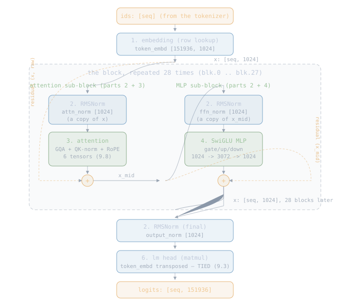
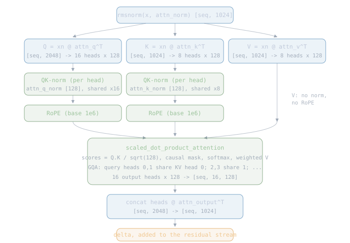

# Qwen3

The family. The loader handed us 310 validated tensors and a
config; the tokenizer turns text into ids. This chapter builds the
thing in between: the forward pass that takes a sequence of ids
and produces, for each position, a score for every one of the
151936 vocabulary entries — the **logits**. The next id is chosen
from the last position's logits; that choosing is the sampler's
chapter, and the loop around it all is the loop's. Here: ids in,
logits out, nothing else.

Everything below is the qwen3 architecture as
[modeling_qwen3.py](https://github.com/huggingface/transformers/blob/main/src/transformers/models/qwen3/modeling_qwen3.py)
defines it (the modeling code outranks papers — [Reading the
Model](03-reading-the-model.md), 6.3), sized by the config numbers
the loader read. The family paper is the
[Qwen3 Technical Report](https://arxiv.org/abs/2505.09388) — the
sizes we support, the training story, and the differences from
Qwen2. Implement the family once and every checkpoint size runs on
config numbers alone.

## 9.1 The parts

Six parts. One runs once at the start, one runs once at the end,
and four of them stack into a block that repeats 28 times. Every
part below cites the paper it comes from at first mention; here is
the complete reference set for later, in one place:

| part | paper | year |
|---|---|---|
| the whole block shape | [Attention Is All You Need](https://arxiv.org/abs/1706.03762) | 2017 |
| the family, as shipped | [Qwen3 Technical Report](https://arxiv.org/abs/2505.09388) | 2025 |
| tied lm head (9.3) | [Using the Output Embedding to Improve LMs](https://arxiv.org/abs/1608.05859) | 2016 |
| pre-norm residual (9.4) | [On Layer Normalization in the Transformer Architecture](https://arxiv.org/abs/2002.04745) | 2020 |
| RMSNorm (9.5) | [Root Mean Square Layer Normalization](https://arxiv.org/abs/1910.07467) | 2019 |
| SwiGLU (9.6) | [GLU Variants Improve Transformer](https://arxiv.org/abs/2002.05202) | 2020 |
| RoPE (9.7) | [RoFormer: Enhanced Transformer with Rotary Position Embedding](https://arxiv.org/abs/2104.09864) | 2021 |
| GQA (9.8) | [GQA: Training Generalized Multi-Query Transformer Models from Multi-Head Checkpoints](https://arxiv.org/abs/2305.13245) | 2023 |
| QK-norm (9.8) | [Query-Key Normalization for Transformers](https://arxiv.org/abs/2010.04245) | 2020 |

The forward pass as a whole:

<div class="diagram"></div>

| # | part | tensors it consumes | runs |
|---|---|---|---|
| 1 | embedding | `token_embd.weight` | once, at the start |
| 2 | RMSNorm | `attn_norm`, `ffn_norm` (per block), `output_norm` | twice per block + once at the end |
| 3 | attention | `attn_q`, `attn_k`, `attn_v`, `attn_q_norm`, `attn_k_norm`, `attn_output` (per block) | once per block |
| 4 | SwiGLU MLP | `ffn_gate`, `ffn_up`, `ffn_down` (per block) | once per block |
| 5 | residual stream | — (it is the wiring, not a tensor) | throughout |
| 6 | lm head | `token_embd.weight` again (tied) | once, at the end |

That is the complete inventory: 2 global tensors + 11 per block ×
28 blocks = 310, exactly the set the loader's contract demanded.

The sections below explain each part, simplest first: the numbers
that size everything (9.2), the embedding and the tied head (9.3),
the residual stream (9.4), RMSNorm (9.5), the SwiGLU MLP (9.6),
RoPE (9.7), and attention with Qwen3's two signatures — grouped
queries and QK-norm (9.8). Then the block assembled (9.9), the
whole pass in MLX calls (9.10), and the module layout (9.11).

## 9.2 The numbers

Every shape in this chapter comes from seven config values the
loader read (chapter 7's `Qwen3Config`). For Qwen3-0.6B:

| config key (GGUF) | value | what it sizes |
|---|---|---|
| `block_count` | 28 | how many times the block repeats |
| `embedding_length` | 1024 | the width of the residual stream (called `hidden`) |
| `feed_forward_length` | 3072 | the MLP's inner width |
| `attention.head_count` | 16 | query heads |
| `attention.head_count_kv` | 8 | key/value heads (GQA — 9.8) |
| `attention.key_length` / `value_length` | 128 | width of ONE head (`head_dim`) |
| `rope.freq_base` | 1000000 | RoPE's rotation base (9.7) |
| `context_length` | 40960 | max positions the model was trained for |

The landmine from 6.3, now with consequences: `head_dim` is 128
**explicitly**, while `hidden / heads = 1024 / 16 = 64`. Qwen3's
attention is WIDER than its residual stream: 16 heads × 128 = 2048
values of query per position, projected back down to 1024 on the
way out. Compute `head_dim` instead of reading it and every weight
still loads — shapes like `[2048, 1024]` even look plausible — but
the model generates garbage. The derived shapes:

```text
q_rows  = 16 x 128 = 2048     attn_q:      [2048, 1024]  (ours, row-major)
kv_rows =  8 x 128 = 1024     attn_k/v:    [1024, 1024]
                              attn_output: [1024, 2048]
                              ffn_gate/up: [3072, 1024]
                              ffn_down:    [1024, 3072]
                              token_embd:  [151936, 1024]
```

## 9.3 The embedding and the tied head

The simplest parts, and they are the same tensor.

**In**: `token_embd.weight` is a `[151936, 1024]` table — one row
of 1024 numbers per vocabulary entry, learned during training. The
embedding step is a row lookup: id 9707 becomes row 9707. A
sequence of `seq` ids becomes a `[seq, 1024]` array. No math.

**Out**: at the very end, the model needs to turn the final
`[seq, 1024]` state back into `[seq, 151936]` logits — a score per
vocab entry. That is a matmul against a `[1024, 151936]` matrix.
Qwen3-0.6B does not ship a separate one: it reuses the embedding
table, transposed. This is called **tying** the head, from Press &
Wolf, [Using the Output Embedding to Improve Language
Models](https://arxiv.org/abs/1608.05859) (2016) — it is why the
loader's tensor contract marks `output.weight` optional (absent
here, present in the untied larger sizes). One 151936 × 1024 table
instead of two saves 156M parameters, a quarter of this model.

## 9.4 The residual stream

The wiring rule that makes 28 blocks trainable: a block never
replaces the `[seq, 1024]` state, it **adds to it**. Each
sub-block computes a delta from a normalized copy and adds that
delta back. The normalize-then-sub-block order is **pre-norm**,
argued for over the original post-norm in Xiong et al.,
[On Layer Normalization in the Transformer
Architecture](https://arxiv.org/abs/2002.04745) (2020) — every
modern LLM uses it because it trains at depth without warmup:

```text
x = x + attention(norm(x))     # sub-block 1
x = x + mlp(norm(x))           # sub-block 2
```

The un-normalized running sum `x` is the residual stream. Two
consequences worth keeping in mind while reading the rest:

- the stream is the ONLY path between blocks — whatever block 3
  wants block 20 to know must survive as an addition;
- the norm is applied to the copy going INTO a sub-block, never to
  the stream itself ("pre-norm"). The stream stays raw.

## 9.5 RMSNorm

Before each sub-block, the copy of the stream is rescaled to a
standard size so the math downstream sees inputs in a predictable
range. RMSNorm — Zhang & Sennrich,
[Root Mean Square Layer Normalization](https://arxiv.org/abs/1910.07467)
(2019) — is the trimmed LayerNorm that dropped the mean-centering
step: as fast as it looks, and empirically as good as the full
version on transformer training. Divide each 1024-wide row by its
root-mean-square and multiply by a learned per-channel weight:

```text
rms(x)  = sqrt(mean(x^2) + eps)          eps = 1e-6, from the config
out[i]  = x[i] / rms(x) * weight[i]      weight: the 1024-wide norm tensor
```

That is the whole operation. `attn_norm` and `ffn_norm` are the
per-block weights, `output_norm` is the final one before the tied
head. The `eps` guards division by zero on an all-zero row; the
loader read it from the file rather than assuming, because it is a
trained-with constant like everything else.

## 9.6 The SwiGLU MLP

The second sub-block is where most of the parameters live: three
matmuls and one gate. SwiGLU is one of the gated variants Shazeer
compared in [GLU Variants Improve
Transformer](https://arxiv.org/abs/2002.05202) (2020), and the
winner every serious LLM has shipped since:

```text
gate = silu( x @ ffn_gate^T )      [seq, 1024] -> [seq, 3072]
up   =       x @ ffn_up^T          [seq, 1024] -> [seq, 3072]
out  = (gate * up) @ ffn_down^T    [seq, 3072] -> [seq, 1024]
```

`silu(v) = v * sigmoid(v)` — a smooth curve that passes negative
values near zero and positive values almost unchanged. The
elementwise product `gate * up` lets one projection decide *how
much* of the other passes through, per channel; that gating is the
"GLU" in SwiGLU, and it is the whole reason there are three
matrices here instead of the two a plain MLP would have.

## 9.7 RoPE

Attention (next section) compares positions pairwise, but a matmul
has no idea *where* in the sequence a value came from. RoPE
(rotary position embedding), from Su et al.,
[RoFormer: Enhanced Transformer with Rotary Position
Embedding](https://arxiv.org/abs/2104.09864) (2021), injects
position by rotating each query and key vector by an angle
proportional to its position — position 5 is rotated more than
position 2, and the score between them ends up depending on the
*distance* 5−2 rather than the absolute positions. The mechanics —
pairs of channels as 2D coordinates, one frequency per pair, why
the base stretches the usable context — are taught interactively
in the
[LLM Lab positional-encoding chapter](https://llm-lab.bicepjai.com/llm-pos-enc/);
the paper has the derivation, this book only pins what our family
uses:

| RoPE parameter | Qwen3-0.6B value |
|---|---|
| applied to | Q and K only, after QK-norm, never V |
| rotated width | the full head_dim, 128 (64 frequency pairs) |
| base (theta) | 1,000,000 — from `rope.freq_base`, not the classic 10,000 |
| scaling | none (`rope.scaling.*` keys absent; the gate would refuse them) |

## 9.8 Attention, with Qwen3's two signatures

The part everything else exists to feed, in the shape Vaswani et
al. introduced in
[Attention Is All You Need](https://arxiv.org/abs/1706.03762)
(2017). For each position, build a **query** ("what am I looking
for"), and for every position up to and including it, a **key**
("what do I contain") and a **value** ("what do I contribute").
Scores are query·key dot products; a **softmax** turns each row of
scores into weights that sum to 1 (bigger scores get exponentially
more weight); the output is the weighted sum of values. Positions
after the current one are excluded — the **causal mask** — because
the model may not read the future it is trying to predict.

<div class="diagram"></div>

The two things that make this *Qwen3's* attention and not the
textbook version:

**Grouped-query attention (GQA)** — Ainslie et al.,
[GQA](https://arxiv.org/abs/2305.13245) (2023). 16 query heads but
only 8 key/value heads: each KV head serves two query heads. The
two query heads in a group look for different things in the same
memory. Why: at generation time K and V are what the cache chapter
will keep around per past position, and halving the KV heads
halves that cache — the quality cost of sharing is small, the
memory saving is not.

**QK-norm** — Henry et al.,
[Query-Key Normalization for
Transformers](https://arxiv.org/abs/2010.04245) (2020). After
splitting into heads and before RoPE, each 128-wide query head and
key head is RMSNormed with its own tiny weight (`attn_q_norm`,
`attn_k_norm` — the two `[128]` tensors in every block). All 16
query heads share the one q_norm weight; all 8 KV heads share the
one k_norm weight. This is Qwen3's addition over Qwen2 (which
normed nothing inside attention): it keeps query·key dot products
in a bounded range so softmax never saturates, which is what lets
the family train stably at large sizes. Skip it and the weights
still fit — and the output is garbage, the same silent failure
class as the head_dim landmine.

The full sub-block, shapes annotated:

```text
xn = rmsnorm(x, attn_norm)                          [seq, 1024]
q  = xn @ attn_q^T   -> split into 16 heads         [seq, 16, 128]
k  = xn @ attn_k^T   -> split into 8 heads          [seq, 8, 128]
v  = xn @ attn_v^T   -> split into 8 heads          [seq, 8, 128]
q, k = qk_norm(q), qk_norm(k)                       (per head, 9.5's formula)
q, k = rope(q, pos), rope(k, pos)                   (9.7)
o  = sdpa(q, k, v, causal, scale = 1/sqrt(128))     [seq, 16, 128]
x  = x + concat(o) @ attn_output^T                  [seq, 1024]
```

`sdpa` is scaled-dot-product attention — the scores, mask,
softmax, and weighted sum as one operation. The `1/sqrt(128)`
scale keeps the dot products from growing with head width.

## 9.9 The block, assembled

Everything above, in order, 28 times:

```text
x = embed(ids)                                      [seq, 1024]
for block in 0..28:
    x = x + attention_subblock(x)                   (9.8, uses blk.N.attn_*)
    x = x + mlp_subblock(x)                         (9.6, uses blk.N.ffn_*)
x = rmsnorm(x, output_norm)
logits = x @ token_embd                             [seq, 151936]
```

No step in the loop knows which block it is — block 0 and block 27
run identical code on different weights. The whole pass is the
same for a 300-id prompt (`seq = 300`, called **prefill**) and for
one new id during generation (`seq = 1`) — which is exactly the
inefficiency the cache chapter measures and fixes: without a
cache, generating token 301 recomputes all 300 previous positions'
K and V from scratch.

## 9.10 The pass, in MLX calls

Every operation above maps onto an MLX call from
[MLX](03-mlx.md)'s 5.4 table, reached through `nucleon_mlx`. This
table is the whole forward pass; the family code is these rows
executed in 9.9's order:

| step | nucleon_mlx call | fused? |
|---|---|---|
| embed | `ops::take` on the embedding table, axis 0 | one gather kernel |
| every matmul (q, k, v, o, gate, up, down, lm head) | `ops::matmul` | MLX's tiled matmul |
| RMSNorm + QK-norm | `fast::rms_norm(x, weight, eps)` | one fused kernel |
| RoPE | `fast::rope` (base 1e6, dims 128, offset = position) | one fused kernel |
| silu + gate | `ops::silu`, `ops::multiply` | lazy graph fuses the elementwise chain |
| attention | `fast::scaled_dot_product_attention` (causal mask, scale 1/sqrt(128)) | FlashAttention-style SDPA |
| head split / concat | `Array::reshape` + `transpose` | layout ops, no compute |

Two MLX behaviors the code leans on:

- **Laziness.** None of these calls compute anything; they build a
  graph. The whole 28-block pass is recorded in microseconds, and
  the GPU runs it when the loop finally asks for the logits'
  values (`eval`). One graph, batched dispatches, fusion where MLX
  finds it — this is 5.2's story paying off.
- **Weights stay put.** The `Array`s the loader built live in
  unified memory; nothing is copied per token. Dequantized f32 for
  now — Q8_0-native matmuls are a Part III improvement with a
  before/after number attached.

## 9.11 The module

```rust
pub struct Qwen3 {
    cfg: Qwen3Config,           // the numbers from 9.2
    embed: Array,               // token_embd, shared with the head
    blocks: Vec<Block>,         // 28 of these
    output_norm: Array,
}

struct Block {                  // 11 arrays, one per tensor name
    attn_norm: Array,
    attn_q: Array, attn_k: Array, attn_v: Array,
    attn_q_norm: Array, attn_k_norm: Array,
    attn_output: Array,
    ffn_norm: Array,
    ffn_gate: Array, ffn_up: Array, ffn_down: Array,
}

pub fn from_yamf(y: &Yamf) -> Result<Qwen3, FamilyError>;

impl Qwen3 {
    /// ids in, logits out: [seq] -> [seq, vocab]
    pub fn forward(&self, ids: &[u32]) -> Result<Array, FamilyError>;
}
```

`from_yamf` moves the 310 arrays out of the Yamf map into named
fields — the map lookup happens once at build, never during
generation. Module layout, one concern per file:

| file | concern |
|---|---|
| families/mod.rs | export barrel |
| families/qwen3/mod.rs | export barrel |
| families/qwen3/build.rs | from_yamf: Yamf map to named fields |
| families/qwen3/forward.rs | the pass: 9.9's loop in nucleon_mlx calls |
| families/qwen3/error.rs | `FamilyError` |

The proof the wiring is right is not in this module's unit tests —
no fixture can tell correct attention from subtly-wrong attention.
It is the golden test in the loop chapter: fixed prompt, greedy
sampling, exact token ids against HF transformers running the same
checkpoint.

## 9.12 Upcoming Qwen3 topics

Visible from here, scheduled later:

1. The KV cache: keep each block's K and V per position instead of
   recomputing them — the cache chapter's whole subject, and the
   reason GQA halved the KV heads.
2. Other checkpoint sizes: 1.7B through 32B are config-number
   changes plus one real difference — the larger sizes untie the
   head and ship `output.weight`. The loader already accepts both.
3. Q8_0-native matmuls: skip the dequant-to-f32, multiply the
   quantized blocks directly (Part III, with numbers).
4. Qwen3.8's hybrid blocks: Gated DeltaNet replaces attention in
   three of every four layers — a second block type, a second
   cache shape, and the first custom-kernel candidate
   ([MLX](03-mlx.md), 5.6).

Next: [The Loop](09-generate.md) — sampler, stop set, and the
golden test that proves all 310 tensors are wired right.
