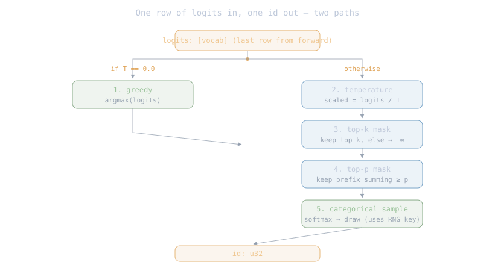

# The Sampler

The forward pass hands back **logits**: a `[seq, vocab]` array where
each row scores every possible next token. The sampler's job is to
turn one row (usually the last, the position we want to continue
from) into a single next-token id. That's it. Nothing about which
model produced the logits crosses this border — the sampler is
**family-agnostic**: same code runs Qwen3, Qwen3.8, Llama, or any
family that lands next.

The reason strategies exist at all: different tasks want different
kinds of pick.

- A benchmark or a golden test wants the most-probable token every
  time — **deterministic**, so two runs match.
- A creative writing prompt wants variety — a fair draw from the
  distribution the model expressed, not always the top id.
- Between those extremes, a set of knobs adjust *how much* variety.

## 11.1 The parts

Five parts. Greedy is the baseline shortcut; the other four
compose into one probabilistic pipeline:

<div class="diagram"></div>

| # | part | job in one line |
|---|---|---|
| 1 | greedy | pick the argmax of the logits row — deterministic |
| 2 | temperature | divide logits by T; T→0 sharpens toward argmax, T>1 flattens toward uniform |
| 3 | top-k | keep only the k largest logits, mask the rest to −∞ |
| 4 | top-p (nucleus) | sort, accumulate probabilities, keep the smallest prefix summing to ≥ p |
| 5 | categorical sample | draw one id from the softmax of the remaining logits |

Two paths through this: **greedy shortcut** (part 1 alone; the four
others sit idle) or **probabilistic pipeline** (parts 2 → 3 → 4 → 5
in that order). The loop chapter's golden test uses greedy;
production chat runs the pipeline. The full theory of every knob
including newer ones (min-p, mirostat, DRY) sits in the
[LLM Lab inference chapter](https://llm-lab.bicepjai.com/llm-inference/);
this chapter only teaches what nucleon builds.

The sections below explain each part simplest first: greedy (11.2),
temperature (11.3), top-k (11.4), top-p (11.5), the categorical
draw (11.6). Then the pipeline assembled (11.7), the API (11.8),
and the tests (11.9).

## 11.2 Greedy

Take the row of logits, return the index with the largest value.
`ops::argmax` over the vocab axis. Deterministic — same logits in,
same id out, every time. This is what the loop chapter's golden
test uses because a reproducible id sequence is the whole point of
comparing against HF transformers.

```text
argmax([2.3, 1.8, 0.4, -1.1, 3.9, 0.7]) = 4
```

No knobs, no RNG. If a caller sets `temperature = 0.0`, the
pipeline short-circuits here.

## 11.3 Temperature

Scale logits by dividing by a positive number **T**:

```text
scaled[i] = logits[i] / T
```

The softmax that follows sees these scaled values. What temperature
does to the probability distribution:

| T | shape of the distribution | picks look like |
|---|---|---|
| → 0 | one spike at argmax, everything else zero | always the top id (greedy) |
| = 1 | the model's raw distribution | as trained |
| > 1 | flatter — more mass on lower-ranked tokens | more variety, more surprise |
| → ∞ | approaches uniform | random word from the vocab |

Common values: 0.7–0.9 for chat (a little more focused than the
raw distribution); 1.0–1.2 for creative writing. Below ~0.3
converges toward greedy without helping. Above ~1.5 the output
loses coherence.

## 11.4 Top-k

After temperature scaling, sort the logits descending and keep only
the top **k**. Everything else is masked to −∞ (which softmax turns
into exactly zero). Then softmax and sample from the remaining k.

```text
logits (already scaled): [2.3, 1.8, 0.4, -1.1, 3.9, 0.7, ...]
top-k = 3:
  keep:  [3.9, 2.3, 1.8]  at their original positions
  mask:  everything else → -∞
softmax → sample
```

Why: even a well-trained model assigns some non-zero probability
to junk tokens. Top-k lops off the tail so those tokens can never
be picked. Common values: 40–100. `k=1` collapses to greedy.

## 11.5 Top-p (nucleus)

After temperature scaling, sort logits descending, run softmax to
get probabilities, then accumulate them in order until the running
sum reaches **p**. Keep only that prefix; mask the rest to −∞.
Softmax again and sample.

```text
sorted probs:   [0.50, 0.25, 0.10, 0.06, 0.04, 0.03, ...]
cumulative:     [0.50, 0.75, 0.85, 0.91, 0.95, ...]
top-p = 0.9:
  keep the first 4 entries (0.91 ≥ 0.9)
  mask the rest → -∞
```

The difference from top-k: the number of tokens kept **adapts to
how confident the model is**. When the model is sure ("the sky is
___"), one token gets 0.9+ probability and top-p keeps just that
one. When it's uncertain ("Once upon a ___"), the mass spreads and
top-p keeps many. Common values: 0.9–0.95.

Top-k and top-p can both be applied — take the intersection of
what each keeps. Usually one is enough.

## 11.6 The categorical draw

Given the (possibly masked) logits, softmax them into a probability
distribution and draw one id from it. The randomness lives here —
everywhere else in the sampler is deterministic given its inputs.

MLX exposes this as `random::categorical(logits, ...)`: it does the
softmax internally and returns a sampled id. It takes an explicit
RNG key so runs are reproducible when the seed is fixed. Our
`Sampler` owns a key that advances each call, so the whole sequence
of picks is reproducible from one seed.

## 11.7 The pipeline, assembled

For probabilistic sampling (temperature > 0), all four steps in
one flow:

```text
input:  logits: [vocab]  (already extracted from forward's last row)

  1. scaled  = logits / T                        (temperature)
  2. topk    = mask_to_neg_inf(scaled, keep top-k)    (if top_k set)
  3. topp    = mask_to_neg_inf(topk,   keep top-p)    (if top_p set)
  4. id      = categorical(topp, rng_key)        (softmax + draw)
```

Order matters: temperature first (otherwise top-k picks on the raw
distribution, not the scaled one). Top-k before top-p is
conventional — cheaper (an already-sorted array from top-k feeds
top-p directly). Both can be off (`None`), in which case the mask
is a no-op and the pipeline reduces to `categorical(scaled)`.

Greedy short-circuit: if `temperature == 0.0`, the sampler returns
`argmax(logits)` immediately and skips 1–4 entirely.

## 11.8 The API

```rust
pub struct SamplerConfig {
    pub temperature: f32,          // 0.0 = greedy shortcut
    pub top_k: Option<usize>,      // None = keep all
    pub top_p: Option<f32>,        // None = keep all
    pub seed: u64,                 // RNG seed
}

pub struct Sampler {
    cfg: SamplerConfig,
    rng: nucleon_mlx::mlx_rs::random::Key,   // advances each sample()
}

pub fn new(cfg: SamplerConfig) -> Result<Sampler, SamplerError>;

impl Sampler {
    /// Pick one id from a [vocab] slice of logits — the last row
    /// of what `Qwen3::forward` returned. Family-agnostic: knows
    /// nothing about which model produced these logits.
    pub fn sample(&mut self, logits: &Array) -> Result<u32, SamplerError>;
}
```

The loop chapter uses two instances of this: one with
`temperature=0.0` (greedy for the golden test) and one with the
user's config (real chat).

Module layout, one concern per file:

| file | concern |
|---|---|
| sampler/mod.rs | export barrel |
| sampler/config.rs | `SamplerConfig` + validation (T ≥ 0, top_p ∈ (0, 1], top_k ≥ 1) |
| sampler/greedy.rs | `argmax` shortcut |
| sampler/pipeline.rs | temperature → top-k → top-p → categorical |
| sampler/error.rs | `SamplerError` |

## 11.9 What the tests will pin

- **greedy is exactly argmax**: for a hand-built logits vector, `sample` returns the known-largest index (temperature=0.0);
- **top-k = 1 collapses to argmax**: even with temperature > 0, `top_k = Some(1)` forces greedy behavior;
- **seed reproducibility**: two `Sampler`s with the same seed return identical id sequences on identical logits;
- **temperature affects distribution**: over N draws, entropy of picks at T=1.5 is measurably higher than at T=0.5;
- **top-p refuses invalid**: `top_p = 0.0` or `1.5` refuses at `SamplerConfig` validation;
- **config validation refuses**: `temperature < 0` refused; `top_k = 0` refused.

Value-correctness of the full pipeline (that the ids we draw match
what `mx.random.categorical` in Python produces on the same seed +
logits) is proven by the loop chapter's golden test against HF
transformers, not here — same deferral pattern as the family
chapter.

## 11.10 Upcoming sampler topics

Visible from here, scheduled later:

1. **Repetition penalty**: down-weight logits for ids already in
   the sequence — cheap fix for the "the the the" degeneration
   that raw sampling sometimes falls into.
2. **min-p**: keep only tokens whose probability is at least
   `min_p × max_prob`. Adaptive like top-p but with a floor,
   not a cumulative ceiling.
3. **Mirostat**: adjust temperature during generation to hold
   perplexity near a target value.
4. **Speculative decoding**: use a small draft model to propose
   several tokens; verify with the big model in one forward call.
   Multi-token acceptance means we may accept 2–5 ids per big
   forward call, 2–5× speedup. Needs a companion draft model.
5. **DRY** (Don't Repeat Yourself): more sophisticated
   repetition-avoidance than plain penalty.

Next: [The CLI](10-cli.md) — ChatML template rendering, streaming
output, argument parsing.
